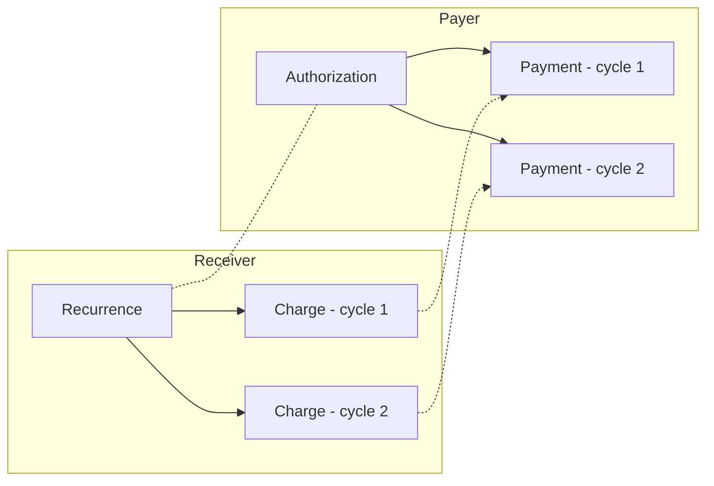
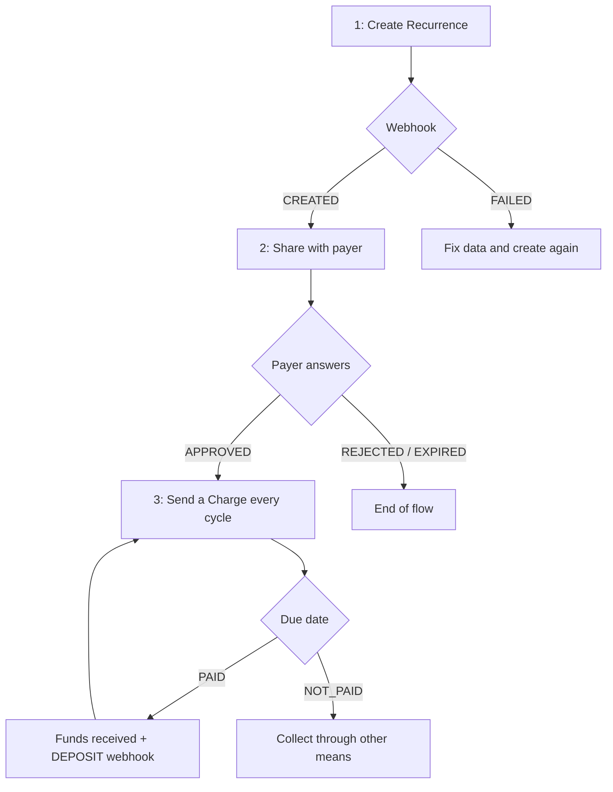
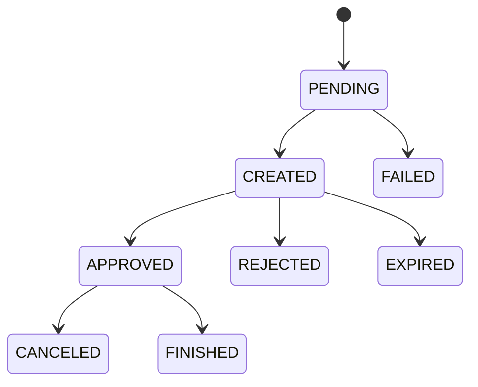
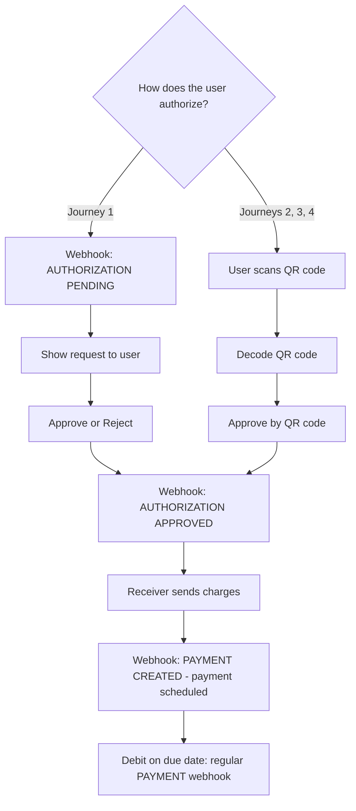

# Pix Automático

Pix Automático is the Central Bank of Brazil's recurring payment scheme for Pix. The payer authorizes a receiver **once**, and from then on each charge the receiver sends is scheduled and debited from the payer's account automatically on its due date. No new approval is needed for each payment.

It fits any recurring billing: subscriptions, utilities, tuition, gym memberships, insurance, installments, and so on.

This guide covers both sides of the integration:
- **Receiver**: you bill your customers through Pix Automático (Part 1)
- **Payer**: your end users, who hold a Z.ro account, authorize and pay Pix Automático charges from other companies (Part 2)

You can implement either side alone, or both.

---

## Core Concepts

Each side of the integration works with its own two objects:

| Side | Object | What it represents | Endpoints |
|---|---|---|---|
| Receiver | **Recurrence** | The recurring billing agreement you create for one payer (frequency, dates, amounts, contract) | `/pix/scheduled-payments/automatic-recurrences` |
| Receiver | **Charge** | One billing within a recurrence (value plus due date) that you send every cycle | `/pix/scheduled-payments/automatic-charges` |
| Payer | **Authorization** | The payer's copy of the recurrence: their consent for the receiver to debit their account | `/pix/scheduled-payments/automatic-authorizations` |
| Payer | **Payment** | A scheduled debit created from a charge, executed automatically on the due date | `/pix/scheduled-payments/automatic-payments` |

A recurrence on the receiver side matches an authorization on the payer side, and each charge matches a scheduled payment.



### Journeys

The **journey** is how the payer gets to authorize the recurrence. You choose it when you create the recurrence.

| Journey | How the payer authorizes | First payment |
|---|---|---|
| `JOURNEY_1` | The payer receives an authorization request in their banking app and approves or rejects it | Only through regular charges |
| `JOURNEY_2` | The payer scans a QR code that only authorizes the recurrence | Only through regular charges |
| `JOURNEY_3` | The payer scans a QR code that authorizes the recurrence **and** pays an immediate first amount, in a single step | Paid immediately, together with the authorization |
| `JOURNEY_4` | The payer scans a dynamic QR code to pay (or schedule) a due-date charge, and is then offered the option to authorize the recurrence | Paid as a regular Pix QR code payment; authorizing is optional |
| `JOURNEY_4_STATIC` | Same as `JOURNEY_4`, but with a static QR code | Same as `JOURNEY_4` |

### Recurrence Rules

- **Frequency**: `WEEKLY`, `MONTHLY`, `QUARTERLY`, `SEMI_ANNUALLY` or `ANNUALLY`. Billing cycles are counted from `start_date`, and **only one charge is allowed per cycle**.
- **Duration**: `end_date` is optional. Without it, the recurrence is open-ended.
- **Fixed or variable value**:
  - **Fixed**: send `value`. Every charge must be exactly this amount.
  - **Variable**: omit `value`. You can send `floor_max_value`, a floor for the maximum the payer may authorize. Example: with `floor_max_value` of R$ 10.00 (`1000`), the payer can cap their payments at R$ 10.00 or more, but never lower.
  - `value` and `floor_max_value` are mutually exclusive.
- **Calendar**: payments can be due on any day, including weekends and holidays.
- **Amounts**: all amounts are integers in BRL cents (`1000` = R$ 10.00), unless stated otherwise.
- **Times**: all cutoff times in this guide are in Brasília time (BRT).

---

## Prerequisites

You will need:
- an authenticated user with a finished onboarding
- `nonce` header on every request
- `x-wallet-uuid` header to select the wallet (optional: if empty, your default wallet is used)
- webhooks configured for your account (see [Webhooks](/baas/api-overview/webhooks))

**Receivers must be legal persons (CNPJ).** Creating a recurrence or a charge from a natural person account is rejected with `403`. Payers can be natural persons (CPF) or legal persons (CNPJ).

---

# Part 1: Receiver Integration

## Receiver Flow Overview



---

## Step 1: Create the Recurrence

`POST /pix/scheduled-payments/automatic-recurrences`

**Required body (all journeys):**
- `journey` (enum, see [Journeys](#journeys))
- `frequency` (enum: `WEEKLY`, `MONTHLY`, `QUARTERLY`, `SEMI_ANNUALLY`, `ANNUALLY`)
- `start_date` (string, `YYYY-MM-DD`): due date of the first payment
- `contract_number` (string): your contract or reference code for this payer

**Optional body (all journeys):**
- `end_date` (string, `YYYY-MM-DD`)
- `value` (integer, cents): fixed value for every charge
- `floor_max_value` (integer, cents): only for variable value, see [Recurrence Rules](#recurrence-rules)
- `contract_description` (string)
- `tags` (array of strings, max 5): free labels you can filter by later

**Journey-specific fields:**

| Field | J1 | J2 | J3 | J4 | J4 static | Description |
|---|:-:|:-:|:-:|:-:|:-:|---|
| `owner_ispb` | ✔ | ✔ | ✔ | ✔ | | ISPB of the payer's bank |
| `owner_document` | ✔ | ✔ | ✔ | ✔ | | Payer document (CPF or CNPJ): the account holder who will be debited |
| `owner_name` | | | ✔ | ✔ | | Payer name |
| `owner_bank_branch` | ✔ | | | | | Payer's branch |
| `owner_bank_account` | ✔ | | | | | Payer's account number |
| `request_expiration_date` | ✔ | | | | | Deadline for the payer to answer (`YYYY-MM-DD`) |
| `debtor_document` | | ✔ | ✔ | ✔ | | Debtor document: the person the service is provided to, who may differ from the payer |
| `debtor_name` | | ✔ | ✔ | ✔ | | Debtor name |
| `pix_key_id` | | | ✔ | ✔ | ✔ | ID of **your** Pix key that receives the QR code payment |
| `charge_value` | | | ✔ | ✔ | optional | Value of the immediate (J3) or due-date (J4) payment in the QR code |
| `charge_due_date` | | | | ✔ | | Due date of the QR code charge (`YYYY-MM-DD`) |

**Optional, `JOURNEY_4` only:** `interest_perc_value` (monthly %), `fine_value` + `fine_type` (`AMOUNT` or `PERCENTAGE`), `discount_value` + `discount_type` (`AMOUNT` or `PERCENTAGE`). These three values are decimals in reais or percent, not cents.

**Example: Journey 1, fixed monthly value:**

```json
{
  "journey": "JOURNEY_1",
  "frequency": "MONTHLY",
  "start_date": "2026-11-10",
  "end_date": "2027-11-10",
  "value": 4990,
  "owner_ispb": "26264220",
  "owner_document": "83003535005",
  "owner_bank_branch": "0001",
  "owner_bank_account": "123456",
  "request_expiration_date": "2026-11-05",
  "contract_number": "GYM-000123",
  "contract_description": "Gym monthly subscription",
  "tags": ["gym", "monthly"]
}
```

**Example: Journey 2, variable value with floor:**

```json
{
  "journey": "JOURNEY_2",
  "frequency": "MONTHLY",
  "start_date": "2026-11-10",
  "floor_max_value": 10000,
  "owner_ispb": "26264220",
  "owner_document": "83003535005",
  "debtor_document": "83003535005",
  "debtor_name": "John Doe",
  "contract_number": "ENERGY-778899",
  "contract_description": "Electricity bill"
}
```

**Returns:** `id`, `status` (`PENDING`), `state` (`PENDING_CONFIRMED`)

**Important:**
- Creation is **asynchronous**. The recurrence starts as `PENDING` while it is registered in the Pix system. Wait for the webhook:
  - `PIX AUTOMATIC RECURRENCE CREATED`: registered, ready to be shared with the payer
  - `PIX AUTOMATIC RECURRENCE FAILED`: registration failed. The recurrence is deleted. Check `failed_code` / `failed_message`, fix the data and create a new one
- Journey 1 only:
  - `request_expiration_date` can be **at most 30 days** from today
  - `start_date` must be **after** `request_expiration_date`

---

## Step 2: Get the Recurrence to the Payer

How the payer receives the recurrence depends on the journey.

### Journey 1: Authorization Request

You don't need to do anything else. Once the recurrence is `CREATED`, the payer's bank shows them the authorization request, and they approve or reject it in their banking app.

### Journeys 2, 3 and 4: QR Code

`GET /pix/scheduled-payments/automatic-recurrences/{id}`

Once the recurrence is `CREATED`, read it to get `qr_code_emv`. That's the Pix "copia e cola" code. Render it as a QR code, or show it as text so the payer can paste it into their banking app.

```json
{
  "id": "d1952c4b-9348-41ab-99a3-05b11459aded",
  "status": "CREATED",
  "state": "CREATED_CONFIRMED",
  "journey": "JOURNEY_2",
  "frequency": "MONTHLY",
  "start_date": "2026-11-10",
  "floor_max_value": 10000,
  "contract_number": "ENERGY-778899",
  "qr_code_emv": "00020101021226...6304ABCD",
  "created_at": "2026-10-02T13:00:00.000Z",
  "updated_at": "2026-10-02T13:00:02.000Z"
}
```

- **Journey 3**: the payer authorizes and pays `charge_value` immediately. The immediate payment arrives as a regular Pix deposit (`DEPOSIT` webhook).
- **Journey 4**: the payer pays the due-date charge first and is then offered the authorization. Paying the charge does **not** mean the recurrence was authorized. Only `PIX AUTOMATIC RECURRENCE APPROVED` confirms it.

### The Payer's Answer

You get one of these webhooks:
- `PIX AUTOMATIC RECURRENCE APPROVED`: the payer authorized it. You can start sending charges (Step 3)
- `PIX AUTOMATIC RECURRENCE REJECTED`: the payer refused it
- `PIX AUTOMATIC RECURRENCE EXPIRED` (Journey 1): the payer did not answer before `request_expiration_date`

`REJECTED` and `EXPIRED` are final. To try again, create a new recurrence.

---

## Step 3: Send a Charge Every Cycle

`POST /pix/scheduled-payments/automatic-charges`

Once the recurrence is `APPROVED`, you send one charge per billing cycle with its value and due date. The payer's bank schedules it and debits the payer automatically on the due date.

**Required body:**
- `pix_automatic_recurrence_id` (string, UUID)
- `value` (integer, cents)
- `due_date` (string, `YYYY-MM-DD`)

```json
{
  "pix_automatic_recurrence_id": "d1952c4b-9348-41ab-99a3-05b11459aded",
  "value": 4990,
  "due_date": "2026-11-10"
}
```

**Returns:** `id`, `status` (`PENDING_WAITING`)

**Rules (Central Bank requirements):**
- **Timing**: send the charge **between 10 and 2 calendar days before** `due_date` (both inclusive). For a charge due on the 10th, send it from the 1st to the 8th. Outside this window the request is rejected
- The recurrence must be `APPROVED`
- `due_date` must be within the recurrence period: on or after `start_date`, and not after `end_date`
- **One charge per cycle**. Another charge in the same cycle is rejected. Only a charge that is `CANCELED` or `CREATED_FAILED` frees the cycle for a new one. A `NOT_PAID` charge still uses up its cycle
- **Value**:
  - Fixed recurrence: the value must be **exactly** the recurrence `value`
  - Variable recurrence: the value must not exceed the maximum the payer authorized (`payment_max_value`), and should not be lower than `floor_max_value`

**Important:** charge processing is **asynchronous**. Some value checks only happen after the request is accepted. Always wait for the webhook:
- `PIX AUTOMATIC CHARGE CREATED`: the charge is scheduled on the payer's side
- `PIX AUTOMATIC CHARGE CREATED FAILED`: the charge was refused (see `failed_code` / `failed_message`). It is deleted and the cycle is free again, so you can fix it and send a new charge while still within the 2–10 day window

---

## Step 4: Receive the Payment

On the due date, the payer's bank debits the payer's account automatically. You get:
- a regular **`DEPOSIT`** webhook when the funds arrive, the same one you get for any Pix received
- **`PIX AUTOMATIC CHARGE PAID`** for the charge

If the debit cannot be made on the due date (for example, insufficient balance), the payer's bank makes **at least one new attempt during that same day**. If every attempt fails, the charge becomes **`PIX AUTOMATIC CHARGE NOT_PAID`** (sent after the due date). The payment is then no longer collected through Pix Automático, so collect it through other means. The cycle stays used, so you can't send a new charge for it.

---

## Managing Recurrences and Charges

### Cancel a Charge

`POST /pix/scheduled-payments/automatic-charges/{id}/cancel`

- Only charges with status `CREATED` can be canceled
- **Cutoff**: before **22:00 on the day before** `due_date`. For a charge due on the 10th, cancel by 21:59 on the 9th
- The payer's bank is notified and their scheduled payment is canceled
- Webhook: `PIX AUTOMATIC CHARGE CANCELED` (or `CANCELED FAILED` if the cancellation could not be confirmed)

### Cancel a Recurrence

`POST /pix/scheduled-payments/automatic-recurrences/{id}/cancel`

- Only recurrences with status `APPROVED` can be canceled by the receiver
- Every `CREATED` charge due on **D+1 or later** is canceled (D = the day you cancel). **If you cancel after 22:00, only charges due on D+2 or later are canceled.** Charges due before that are still collected
- The payer's bank is notified and the payer's authorization is canceled
- Webhooks: `PIX AUTOMATIC RECURRENCE CANCELED` with `cancellation.reason`, and `PIX AUTOMATIC CHARGE CANCELED` for each charge canceled

If you get `PIX AUTOMATIC RECURRENCE CANCELED FAILED` (state `CANCELED_FAILED`), the cancellation was **not** confirmed by the Pix system and the recurrence is still in force. Contact support.

The payer can also cancel at any time from their bank. You get `PIX AUTOMATIC RECURRENCE CANCELED` with `cancellation.reason` `PAYER_REQUEST`. After that, new charges for that recurrence are rejected.

### Update a Recurrence

`PUT /pix/scheduled-payments/automatic-recurrences/{id}`

Change the value, floor, frequency, dates, contract number, description or tags of an `APPROVED` recurrence. Send only the fields you want to change:

```json
{
  "value": 5990,
  "contract_description": "Gym monthly subscription - Premium plan"
}
```

**Returns:** `old_id`, `old_recurrence_status`, and the new recurrence's `id`, `status`, `state`

**Important: an update creates a new recurrence that must be authorized again.**
- The current recurrence is **canceled**, along with its future charges, using the same D+1 / D+2 rule as [Cancel a Recurrence](#cancel-a-recurrence)
- A **new recurrence** with a **new `id`** is created in the same journey, starting the lifecycle again from `PENDING`
- The payer must approve the new recurrence. In Journey 1 they get a new authorization request. In QR code journeys, fetch the new `qr_code_emv` (Step 2) and share it again
- Use the new `id` for all future charges
- For Journey 1, send a new `request_expiration_date` with the update
- Webhooks: `PIX AUTOMATIC RECURRENCE CANCELED` for the old recurrence, then `CREATED` (and later `APPROVED`) for the new one

### Query Recurrences and Charges

- `GET /pix/scheduled-payments/automatic-recurrences/{id}`: full details, including `next_charge_due_date`, `next_charge_value` and `qr_code_emv`
- `GET /pix/scheduled-payments/automatic-recurrences`: paginated list. Filters: `status`, `owner_document`, `debtor_name`, `contract_number`, `tags`, `frequency`, `created_at_start` / `created_at_end`, `next_charge_due_date_start` / `next_charge_due_date_end`
- `GET /pix/scheduled-payments/automatic-charges/{id}`: charge details
- `GET /pix/scheduled-payments/automatic-charges`: paginated list. Filters: `status`, `pix_automatic_recurrence_id`, `owner_document`, `created_at_start` / `created_at_end`, `due_date_start` / `due_date_end`

See [Pagination](/baas/api-overview/pagination) for `page`, `size`, `sort` and `order`.

---

## Receiver Status Reference

### Recurrence



| Status | Meaning | Webhook |
|---|---|---|
| `PENDING` | Being registered in the Pix system | — |
| `CREATED` | Registered and waiting for the payer's answer | `PIX AUTOMATIC RECURRENCE CREATED` |
| `FAILED` | Registration failed; the recurrence is deleted | `PIX AUTOMATIC RECURRENCE FAILED` |
| `APPROVED` | Authorized by the payer. Charges can be sent | `PIX AUTOMATIC RECURRENCE APPROVED` |
| `REJECTED` | Refused by the payer | `PIX AUTOMATIC RECURRENCE REJECTED` |
| `EXPIRED` | Not answered before `request_expiration_date` (Journey 1) | `PIX AUTOMATIC RECURRENCE EXPIRED` |
| `CANCELED` | Canceled by the receiver, the payer or a Pix participant | `PIX AUTOMATIC RECURRENCE CANCELED` |
| `FINISHED` | Reached its `end_date` | `PIX AUTOMATIC RECURRENCE FINISHED` |

The `state` field adds detail about the last operation: `*_CONFIRMED` means it succeeded, `*_FAILED` means it did not (see `CANCELED_FAILED` above).

### Charge

| Status | Meaning | Webhook |
|---|---|---|
| `PENDING_WAITING` / `PENDING_CONFIRMED` | Being validated and sent to the payer's bank | — |
| `CREATED` | Scheduled on the payer's side, waiting for the due date | `PIX AUTOMATIC CHARGE CREATED` |
| `CREATED_FAILED` | Refused; the cycle is free again | `PIX AUTOMATIC CHARGE CREATED FAILED` |
| `PAID` | Paid | `PIX AUTOMATIC CHARGE PAID` |
| `NOT_PAID` | Not paid on the due date, after the retries | `PIX AUTOMATIC CHARGE NOT PAID` |
| `WAITING_CANCELLATION` | Cancellation in progress | — |
| `CANCELED` | Canceled (see `cancellation_reason`) | `PIX AUTOMATIC CHARGE CANCELED` |
| `CANCELED_FAILED` | Cancellation could not be confirmed | `PIX AUTOMATIC CHARGE CANCELED FAILED` |

---

# Part 2: Payer Integration

This part applies when **your end users pay** Pix Automático charges from their Z.ro account. The receiver can be at any bank.

## Payer Flow Overview



---

## Step 1: Authorize the Recurrence

### Journey 1: Answer an Authorization Request

When a receiver creates a Journey 1 recurrence for your user's account, you get **`PIX AUTOMATIC AUTHORIZATION PENDING`**. Show the user the receiver (`beneficiary`), the contract, the frequency, the dates and the value (`value` or `floor_max_value`), and let them decide **before `request_expiration_date`**.

You can also list pending requests with `GET /pix/scheduled-payments/automatic-authorizations?status=PENDING`.

**Approve:** `POST /pix/scheduled-payments/automatic-authorizations/{id}/approve`

```json
{
  "payment_max_value": 15000
}
```

`payment_max_value` (integer, cents) is optional. It lets the user cap each automatic payment:
- **Variable-value recurrence**: optional, and must be **≥ `floor_max_value`**. Charges above this cap are refused automatically
- **Fixed-value recurrence**: do **not** send it. The request is rejected if you do

**Reject:** `POST /pix/scheduled-payments/automatic-authorizations/{id}/reject`

```json
{
  "rejection_reason": "NOT_INTERESTED"
}
```

`rejection_reason`: `UNRECOGNIZED_RECEIVER` or `NOT_INTERESTED`

**Rules:**
- Only authorizations with status `PENDING` can be approved or rejected
- If `request_expiration_date` passes without an answer, the request is removed and can no longer be approved

**Webhooks:** `PIX AUTOMATIC AUTHORIZATION APPROVED` / `REJECTED`. If the answer could not be confirmed with the receiver's bank, you get `APPROVED FAILED` / `REJECTED FAILED` instead.

### Journeys 2, 3 and 4: Approve by QR Code

**1. Decode the QR code** the user scanned or pasted:

`GET /v2/pix/payments/decode/by-qr-code?emv={qr_code_emv}`

This request also requires the `x-transaction-uuid` header. When the QR code carries a Pix Automático recurrence, the response includes a `composite_qr_code` object with the recurrence details. Show these to the user before they authorize:

```json
{
  "qr_code": {
    "id": "a3b1c2d4-0000-4000-8000-000000000001",
    "type": "QR_CODE_COMPOSITE_PAYMENT",
    "document_value": 4990,
    "recipient_name": "Gym Company LTDA",
    "state": "READY"
  },
  "composite_qr_code": {
    "id": "d5e0bec8-8695-4557-b0dd-021788cd83ef",
    "journey": "JOURNEY_3",
    "recurrence_id": "b2c3d4e5-f6a7-8901-bcde-f01234567890",
    "frequency": "MONTHLY",
    "start_date": "2026-11-10",
    "value": 4990,
    "beneficiary_name": "Gym Company LTDA",
    "beneficiary_document": "12345678000190",
    "debtor_name": "John Doe",
    "contract_number": "GYM-000123",
    "contract_description": "Gym monthly subscription",
    "state": "PENDING",
    "created_at": "2026-10-02T13:00:00.000Z"
  }
}
```

- `qr_code`: the payment part. In Journeys 3 and 4 it carries the amount to be paid now (or on the charge due date)
- `composite_qr_code`: the recurrence the user is about to authorize. Its `id` is the `decoded_composite_qr_code_id` used below

**2. (Journey 4 only) Pay the charge first.** Pay it like any other QR code payment, using `qr_code.id` as `decoded_qr_code_id`:
- `JOURNEY_4`: `POST /pix/payments/by-qr-code/dynamic/due-date-billing`
- `JOURNEY_4_STATIC`: `POST /pix/payments/by-qr-code/static/instant-billing`

Then offer the authorization to the user. In Journey 4, authorizing is **optional**: the user can pay the charge and stop there.

**3. Approve the recurrence:**

`POST /pix/scheduled-payments/automatic-authorizations/approve-by-qrcode/{decoded_composite_qr_code_id}`

```json
{
  "payment_max_value": 15000
}
```

The same `payment_max_value` rules as Journey 1 apply.

**Returns:**
- `id`: the authorization ID
- `payment_id`: **Journey 3 only**. The immediate payment is made as part of this request, and this is its Pix payment ID

**Important:**
- The decoded QR code can only be approved by the same user who decoded it, and only once
- Webhooks: `PIX AUTOMATIC AUTHORIZATION PENDING`, then `PIX AUTOMATIC AUTHORIZATION APPROVED` once confirmed (or `APPROVED FAILED`). In Journey 3 you also get `PIX AUTOMATIC PAYMENT CREATED` for the immediate payment, and the regular `PAYMENT` webhook when it is debited

---

## Step 2: Scheduled Payments Run Automatically

Once the authorization is `APPROVED`, you don't need to call any endpoint for payments to happen.

1. The receiver sends a charge 2–10 days before its due date. A **scheduled payment** is created in your user's account and you get **`PIX AUTOMATIC PAYMENT CREATED`**. Use it to notify the user ahead of time.
2. On the due date, the payment is debited automatically. You get the regular **`PAYMENT`** webhook (or **`PAYMENT FAILED`**), the same one used for any Pix sent.
3. If the debit fails (for example, insufficient balance), **a new attempt is made later the same day**. If it fails again, the payment is not retried. The user must settle it with the receiver through other means.

**Automatic refusals.** Your user is protected: a charge is refused automatically when:
- its value is higher than the authorized `payment_max_value` (variable value), or different from the recurrence `value` (fixed value)
- another payment was already scheduled for the same cycle
- the receiver doesn't match the authorization
- it was not sent between 2 and 10 calendar days before the due date

**Linking a debit to Pix Automático.** To find out whether a `PAYMENT` webhook comes from Pix Automático, look up the payment by its Pix payment ID (the `id` in the `PAYMENT` webhook):

`GET /pix/scheduled-payments/automatic-payments/by-pix-payment/{id}`

---

## Managing Authorizations and Payments

### Cancel a Scheduled Payment

`POST /pix/scheduled-payments/automatic-payments/{id}/cancel`

The user can skip a single payment without canceling the authorization.
- Only payments with status `CREATED` can be canceled
- **Cutoff**: until **23:59 on the day before** `due_date`
- The receiver is notified
- Webhooks: `PIX AUTOMATIC PAYMENT CANCELED` (or `CANCELLATION FAILED`)

### Cancel an Authorization

`POST /pix/scheduled-payments/automatic-authorizations/{id}/cancel`

The user can cancel an authorization at any time.
- Allowed for `PENDING` and `APPROVED` authorizations
- Every scheduled payment due on **D+1 or later** is canceled (D = the day of cancellation). **A payment due today is still debited**
- The receiver is notified and their recurrence is canceled
- Webhooks: `PIX AUTOMATIC AUTHORIZATION CANCELED` (or `CANCELED FAILED`), and `PIX AUTOMATIC PAYMENT CANCELED` for each payment canceled

When the **receiver** cancels the recurrence, you get `PIX AUTOMATIC AUTHORIZATION CANCELED` too. Payments due on D+1 or later are canceled, or D+2 or later if the receiver canceled after 22:00.

When the recurrence reaches its `end_date`, you get `PIX AUTOMATIC AUTHORIZATION FINISHED`.

### Change the Maximum Value

`PUT /pix/scheduled-payments/automatic-authorizations/{id}`

```json
{
  "payment_max_value": 20000
}
```

- Only for `APPROVED` authorizations of **variable-value** recurrences
- Must be **≥ `floor_max_value`**
- Webhooks: `PIX AUTOMATIC AUTHORIZATION UPDATED CONFIRMED` / `UPDATED FAILED`

### Daily Limit per Receiver

`POST /pix/scheduled-payments/automatic-receiver-limits`

Optionally, the user can set a maximum amount per day that Pix Automático may debit for a given receiver (CNPJ):

```json
{
  "receiver_document": "12345678000190",
  "receiver_name": "Gym Company LTDA",
  "daily_limit": 100000
}
```

- One limit per receiver per wallet. It cannot exceed the user's own daily Pix limit
- A scheduled payment that would exceed the limit on its due date is **canceled** and not retried
- `GET /pix/scheduled-payments/automatic-receiver-limits` lists the limits, with `daily_used` and `daily_available` for today
- `GET /pix/scheduled-payments/automatic-receiver-limits/{id}` returns one limit
- `PATCH /pix/scheduled-payments/automatic-receiver-limits/{id}` with `{ "daily_limit": ... }` changes it

### Query Authorizations and Payments

- `GET /pix/scheduled-payments/automatic-authorizations`: paginated list, filter by `status`
- `GET /pix/scheduled-payments/automatic-authorizations/{id}`: authorization details
- `GET /pix/scheduled-payments/automatic-payments`: paginated list, filter by `status`
- `GET /pix/scheduled-payments/automatic-payments/{id}`: payment details, including its authorization
- `GET /pix/scheduled-payments/automatic-payments/by-pix-payment/{id}`: payment by Pix payment ID

---

## Payer Status Reference

### Authorization

| Status | Meaning | Webhook |
|---|---|---|
| `PENDING` | Waiting for the user's answer (Journey 1), or being confirmed (QR code journeys) | `PIX AUTOMATIC AUTHORIZATION PENDING` |
| `WAITING_APPROVAL` / `WAITING_REJECTION` | The answer is being sent to the receiver's bank | — |
| `APPROVED` | Active: payments are scheduled automatically | `PIX AUTOMATIC AUTHORIZATION APPROVED` |
| `REJECTED` | Refused by the user | `PIX AUTOMATIC AUTHORIZATION REJECTED` |
| `WAITING_CANCELLATION` | Cancellation in progress | — |
| `CANCELED` | Canceled by the user or the receiver | `PIX AUTOMATIC AUTHORIZATION CANCELED` |
| `FINISHED` | The recurrence reached its `end_date` | `PIX AUTOMATIC AUTHORIZATION FINISHED` |

Failures are reported through `state`, with the status unchanged: `APPROVED_FAILED`, `REJECTED_FAILED`, `CANCELED_FAILED`, `UPDATED_FAILED`. A successful max value change is reported as `UPDATED_CONFIRMED`.

### Payment

| Status | Meaning | Webhook |
|---|---|---|
| `CREATED` | Scheduled; it will be debited on `due_date` | `PIX AUTOMATIC PAYMENT CREATED` |
| `WAITING_CANCELLATION` | Cancellation in progress | — |
| `CANCELED` | Canceled | `PIX AUTOMATIC PAYMENT CANCELED` |
| `CANCELLATION_FAILED` | Cancellation could not be confirmed; the payment remains scheduled | `PIX AUTOMATIC PAYMENT CANCELLATION FAILED` |

The debit itself is reported through the regular `PAYMENT` / `PAYMENT FAILED` webhooks.

---

## Webhooks Summary

| Side | Webhook group | Triggered on |
|---|---|---|
| Receiver | Pix Automatic Recurrence | `CREATED`, `FAILED`, `APPROVED`, `REJECTED`, `CANCELED`, `CANCELED FAILED`, `EXPIRED`, `FINISHED` |
| Receiver | Pix Automatic Charge | `CREATED`, `CREATED FAILED`, `PAID`, `NOT PAID`, `CANCELED`, `CANCELED FAILED` |
| Receiver | Deposit | `DEPOSIT` for each payment received |
| Payer | Pix Automatic Authorization | `PENDING`, `APPROVED`, `REJECTED`, `CANCELED`, `FINISHED`, `APPROVED FAILED`, `REJECTED FAILED`, `CANCELED FAILED`, `UPDATED CONFIRMED`, `UPDATED FAILED` |
| Payer | Pix Automatic Payment | `CREATED`, `CANCELED`, `CANCELLATION FAILED` |
| Payer | Payment | `PAYMENT` / `PAYMENT FAILED` for each debit |

Use `event_id` (where present) to deduplicate deliveries. Full payloads are in [Webhooks](/baas/api-overview/webhooks).

---

## Testing in Sandbox

In Sandbox there is no real counterparty bank to approve recurrences or settle charges. Use these **sandbox-only** endpoints to move objects through their lifecycle. They follow the same business rules and trigger the same webhooks as the real flow. They **do not exist in Production**.

| Endpoint | Body `status` values |
|---|---|
| `POST /pix/scheduled-payments/automatic-recurrences/{id}/change-status` | `APPROVED`, `REJECTED`, `CANCELED` |
| `POST /pix/scheduled-payments/automatic-charges/{id}/change-status` | `PAID`, `NOT_PAID`, `CANCELED` |
| `POST /pix/scheduled-payments/automatic-authorizations/{id}/change-status` | `CANCELED` |

```json
{
  "status": "APPROVED"
}
```

To approve a `JOURNEY_4_STATIC` recurrence, also send the payer data: `owner_ispb`, `owner_person_type` (`NATURAL_PERSON` or `LEGAL_PERSON`) and `owner_document`.

---

## Minimal Integration Sequence

**Receiver:**
1. `POST /pix/scheduled-payments/automatic-recurrences` and wait for `RECURRENCE CREATED`.
2. Journeys 2–4: `GET /pix/scheduled-payments/automatic-recurrences/{id}` and show `qr_code_emv` to the payer.
3. Wait for `RECURRENCE APPROVED`.
4. Every cycle, 2–10 days before the due date: `POST /pix/scheduled-payments/automatic-charges`, then wait for `CHARGE CREATED`.
5. On the due date: `DEPOSIT` plus `CHARGE PAID`, or `CHARGE NOT PAID`.

**Payer:**
1. Journey 1: on `AUTHORIZATION PENDING`, call `approve` or `reject`.
2. Journeys 2–4: decode the QR code (`GET /v2/pix/payments/decode/by-qr-code`). Journey 4 only: pay `qr_code.id` first. Then call `approve-by-qrcode/{composite_qr_code.id}`.
3. Wait for `AUTHORIZATION APPROVED`.
4. On `PAYMENT CREATED`, notify the user of the upcoming debit. On the due date you get `PAYMENT` / `PAYMENT FAILED`.

---

## Error Handling

**403 on create recurrence / create charge:**
- The account is a natural person. Only legal persons (CNPJ) can be receivers
- On update and cancel: the recurrence or charge does not belong to your wallet

**4xx on create charge:**
- The due date is not between 2 and 10 days ahead
- The recurrence is not `APPROVED`, or the due date is outside `start_date` / `end_date`
- A charge already exists for that cycle

**4xx on cancel:**
- Charge: not `CREATED`, or after 22:00 on the day before the due date
- Recurrence: not `APPROVED` (only approved recurrences can be canceled or updated)
- Scheduled payment: not `CREATED`, or on/after the due date

**4xx on approve:**
- The authorization is no longer `PENDING`, was already answered, or expired
- `payment_max_value` was sent for a fixed-value recurrence, or is lower than `floor_max_value`
- QR code: the decoded composite QR code was already used, or was decoded by another user

**`*_FAILED` webhooks:**
- Always check `failed_code` and `failed_message`. A `CREATED FAILED` charge or `FAILED` recurrence can be fixed and sent again. A `*_CANCELED_FAILED` / `UPDATED_FAILED` state means the previous situation is still in force

**401:**
- User authentication failed
