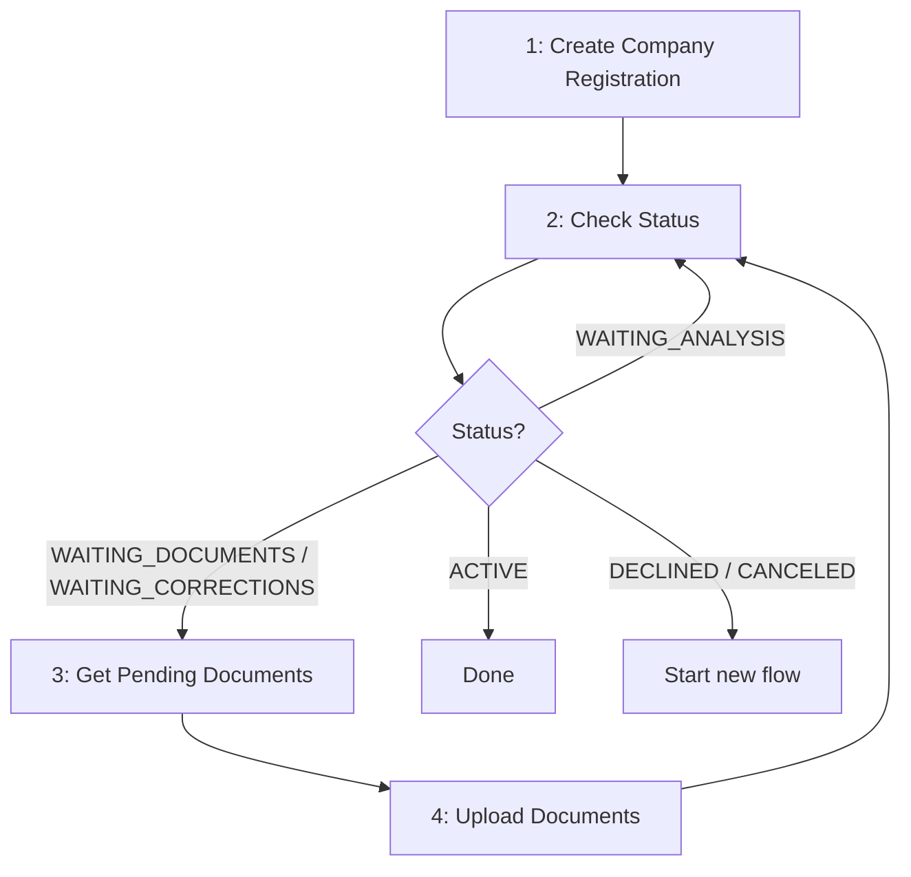

# Company Registration

Essential flow to register a company after Legal Person onboarding in the BaaS API.

## Prerequisite

Before calling company registration endpoints, complete [Legal Person Onboarding](./legal-person-onboarding) and wait until the onboarding status is `FINISHED`.

You will need:
- `onboarding_id` from the finished legal person onboarding
- authenticated legal person user
- `nonce` header on every request
- `x-transaction-uuid` header for the create request

---

## Flow Overview

Execute steps 1-2 first. If the status requires documents, execute steps 3-4 and repeat step 2 until a terminal status is reached.

---

## Step 1: Create Company Registration

`POST /users/company-registrations`

Create the provider-side company registration using a finished legal person onboarding.

**Required body:**
- `onboarding_id`
- `opening_date` (`YYYY-MM-DD`)
- `revenue` (BRL cents)
- `establishment_format`
- `cnae` (7 digits)
- `legal_nature_code` (4 digits)

**Optional body:**
- `state_registration`
- `partner_changed`

**Returns:** `id`, `cnpj`, `status`, `created_at`

**Expected initial status:** `WAITING_ANALYSIS`

**Important:** If an active company registration already exists for the same CNPJ, the request is rejected.

---

## Step 2: Check Status

`GET /users/company-registrations/{id}`

Use this endpoint as the source of truth for the current company registration state.

**If webhooks are configured:**
- `COMPANY_REGISTRATION_ONBOARDING_STATUS_UPDATED` can notify status changes with `WAITING_ANALYSIS`, `WAITING_DOCUMENTS`, `WAITING_CORRECTIONS`, `ACTIVE`, `DECLINED`, or `CANCELED`
- `COMPANY_REGISTRATION_ONBOARDING_APPROVED` is the final approval event for clients that depend on the company registration plus alias bank account readiness

Use polling as fallback or when webhook delivery is not configured.

| Status | Meaning | Action |
|--------|---------|--------|
| `WAITING_ANALYSIS` | Registration created and under provider analysis | Wait or keep polling |
| `WAITING_DOCUMENTS` | Additional documents are required | Go to Steps 3-4 |
| `WAITING_CORRECTIONS` | Corrections or new documents are required | Go to Steps 3-4 |
| `ACTIVE` | Registration approved and active | Flow finished. If you also depend on alias bank account readiness, use `bank_account_status` or `COMPANY_REGISTRATION_ONBOARDING_APPROVED` |
| `DECLINED` | Registration not approved | Start a new flow after correction |
| `CANCELED` | Registration canceled | Start a new flow if needed |

---

## Step 3: Get Pending Documents

`GET /users/company-registrations/{id}/pending-documents`

Call this endpoint when the company registration status is `WAITING_DOCUMENTS` or `WAITING_CORRECTIONS`.

This endpoint is the authoritative checklist for what is still missing.

**How to read the response:**
- `subjects`: array of document subjects, one per entity (company or representative)
- `type = COMPANY`: document belongs to the legal person
- `type = LEGAL_REPRESENTATIVE`: document belongs to one legal representative
- `uploaded`: categories already uploaded for this subject
- `required`: every category in this array must be uploaded
- `one_of`: upload at least one category from each group
- `legal_representative_id`: use this value when uploading representative-scoped documents

**Integration rule:** Do not hardcode a fixed company document checklist. Always use this endpoint to decide what to upload.

---

## Step 4: Upload Documents

`POST /users/company-registrations/{company_registration_id}/company-documents`

Upload documents with `multipart/form-data`.

**Required fields:**
- `category`
- `file`

**Optional field:**
- `legal_representative_id` → required when the category is scoped to a legal representative

**Integration rules:**
- Upload only categories returned by Step 3
- Send `legal_representative_id` for representative documents
- Accepted formats: `application/pdf`, `image/jpeg`, `image/jpg`
- Max file size follows the configured environment limit

After uploads, go back to Step 2 and recheck the company registration status.

---

## Minimal Integration Sequence

1. Complete [Legal Person Onboarding](./legal-person-onboarding).
2. Create the company registration and save the returned `id`.
3. Poll `GET /users/company-registrations/{id}` or listen for webhooks.
4. If status is `WAITING_DOCUMENTS` or `WAITING_CORRECTIONS`, call `GET /users/company-registrations/{id}/pending-documents`.
5. Upload every missing company or representative document.
6. Repeat from step 3 until `ACTIVE`, `DECLINED`, or `CANCELED`.

---

## Optional Read Endpoints

- `GET /users/company-registrations/{id}` → get one company registration
- `GET /users/company-registrations` → list company registrations and filter by `status` or `cnpj`

See [Webhooks](/baas/api-overview/webhooks) for company registration webhook payload examples.

---

## Error Handling

**422 on create or upload:**
- Fix request data and retry

**403:**
- Authenticated user does not own the company registration

**404:**
- Company registration not found

**DECLINED or CANCELED:**
- Correct the data or documents and start a new company registration flow
