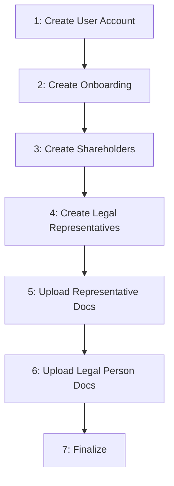

# Legal Person Onboarding

Complete flow for onboarding a Legal Person through the BaaS API.

## Flow Overview



Execute steps 1-7 in order.

---

## Step 1: Create User Account

`POST /users/accounts`

Create user account as Legal Person with CNPJ.

**Returns:** `user_id`

---

## Step 2: Create Onboarding

`POST /users/onboarding/legal-person`

Create onboarding record with legal person address and revenue.

**Returns:** `onboarding_id` → Save for Steps 6 and 7

**Note:** Cannot create if user has active onboarding (PENDING, IN_PROCESS, FINISHED). Can create new if previous was REJECTED or FAILED.

---

## Step 3: Create Shareholders

`POST /users/shareholders`

Register shareholders. Can be Natural Person (CPF) or Legal Person (CNPJ).

**Returns:** `shareholder_id` → Save for Step 4

**Requirements:**
- At least one shareholder
- If shareholder is Legal Person, must link a legal representative in Step 4
- Total `participation_percentage` ≤ 100%

---

## Step 4: Create Legal Representatives

`POST /users/legal-representatives`

Register legal representatives. Must be Natural Person with CPF.

**Requires:** `shareholder_id` from Step 3

**Returns:** `legal_representative_id` → Save for Step 5

**Requirements:**
- Must be Natural Person (CPF)
- Must link to shareholder via `shareholder_id`
- Legal Person shareholders must have at least one representative
- At least one legal representative required

---

## Step 5: Upload Representative Documents

`POST /users/legal-representatives/{id}/documents`

Upload documents for each legal representative (multipart/form-data).

**Required:**
- `selfie` (file)
- `identity_document` (file)
- `identity_document_type` (enum: `id`, `cnh`, `passaporte`)
- `qualification_declaration` (file)

**Optional:**
- `income_declaration` (file)
- `address_proof` (file)

**Requirements:**
- Upload for ALL legal representatives
- Max 25 MB per file
- Formats: PDF, JPEG, JPG, PNG

---

## Step 6: Upload Legal Person Documents

`POST /users/onboarding/legal-person/{id}/documents`

Upload legal person documents. Call once per document type.

**Body:**
- `file` (binary)
- `type` (enum)

**Required types:**
- `SOCIAL_CONTRACT`
- `BALANCE_SHEET` OR `REVENUE_STATEMENT` (at least one)

**Optional:**
- `KYC_AML_POLICY`

**Requirements:**
- Max 25 MB per file
- Formats: PDF, JPEG, JPG, PNG

---

## Step 7: Finalize

`POST /users/onboarding/legal-person/{id}/finalize`

Submit onboarding for processing.

**Returns:** Status changes to `IN_PROCESS`

**Validation:**
- ✓ Onboarding exists and is in PENDING status
- ✓ At least one shareholder created
- ✓ At least one legal representative created
- ✓ All legal representatives are Natural Person
- ✓ All legal representatives linked to shareholders
- ✓ Legal Person shareholders have at least one representative linked
- ✓ All legal representatives have uploaded: selfie, identity_document, qualification_declaration
- ✓ Legal person has uploaded: SOCIAL_CONTRACT
- ✓ Legal person has uploaded: BALANCE_SHEET or REVENUE_STATEMENT
- ✓ Total shareholder participation does not exceed 100%

**If validation fails:** Returns `422` with error details. Fix and retry.

After finalization, use the endpoint below to check the onboarding status.

---

## Checking Status

`GET /users/onboarding/legal-person/{id}`

Use this endpoint to check the current onboarding status.

**Status flow:**
```
PENDING → IN_PROCESS → FINISHED / REJECTED / FAILED
```

| Status | Meaning | Action |
|--------|---------|--------|
| `PENDING` | Incomplete | Complete steps 1-7 |
| `IN_PROCESS` | Processing | Wait |
| `FINISHED` | Approved | Proceed |
| `REJECTED` | Not approved | Create new onboarding |
| `FAILED` | Error | Contact support |

**Webhooks:**

If webhooks are configured, you will receive notifications for:
- `FINISHED` - Onboarding approved
- `FAILED` - Processing error

Configure webhooks to receive real-time notifications instead of polling this endpoint.

---

## Error Handling

**422 on finalization:**
- Response contains missing requirements
- Fix and retry

**REJECTED:**
- Create new onboarding with corrected data

**FAILED:**
- Contact support with onboarding ID
