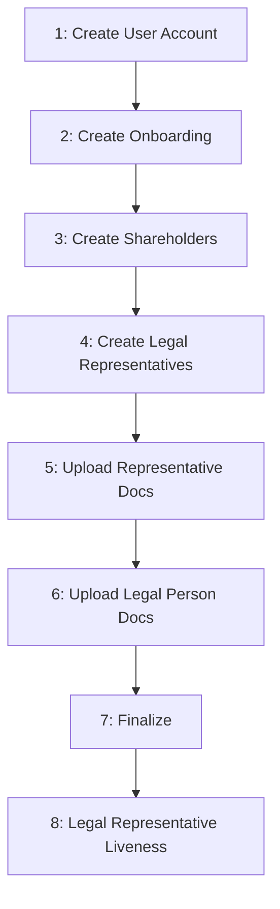

# Legal Person Onboarding

Complete flow for onboarding a Legal Person through the BaaS API.

## Flow Overview



Execute steps 1-7 in order. Step 8 happens while the onboarding is `IN_PROCESS`: each legal representative completes an individual liveness check.

---

## Step 1: Create User Account

`POST /users/accounts`

Create user account as Legal Person with CNPJ.

**Returns:** `id`

**Note:** If a previous onboarding was **REJECTED** or **FAILED**, reuse the existing `id` and **skip to** [Step 2](#step-2-create-onboarding).

---

## Step 2: Create Onboarding

`POST /users/onboardings/legal-person`

Create onboarding record with legal person address and revenue.

**Returns:** `id` → Save for Steps 6 and 7

**Note:** Cannot create if user already has an onboarding in any status other than REJECTED, FAILED or EXPIRED. Can create new if previous was REJECTED, FAILED or EXPIRED.

---

## Step 3: Create Shareholders

`POST /users/shareholders`

Register shareholders. Can be Natural Person (CPF) or Legal Person (CNPJ).

**Returns:** `id` → Save for Step 4

**Requirements:**
- At least one shareholder
- If shareholder is Natural Person (CPF), the `document` must match the legal representative's document created in Step 4
- Legal Person (CNPJ) shareholders must have at least one legal representative linked to them (validated at finalization)
- Total `participation_percentage` ≤ 100%

---

## Step 4: Create Legal Representatives

`POST /users/legal-representatives`

Register legal representatives. Must be Natural Person with CPF.

**Requires:** `shareholder_id` from Step 3

**Returns:** `id` → Save for Step 5

**Requirements:**
- Must be Natural Person (CPF)
- Must link to a shareholder of the same onboarding via `shareholder_id` (Natural Person or Legal Person shareholder)
- If the linked shareholder is Natural Person, its `document` must match the representative's document
- At least one legal representative required

---

## Step 5: Upload Representative Documents

`POST /users/legal-representatives/{id}/documents`

Upload documents for each legal representative (multipart/form-data).

**Required:**
- `selfie` (file)
- `identity_document` (file)
- `identity_document_type` (enum: `id`, `cnh`, `passport`)
- `qualification_declaration` (file)

**Optional:**
- `income_declaration` (file)
- `address_proof` (file)

**Requirements:**
- Upload for ALL legal representatives
- Max 25 MB per file
- Formats: PDF, JPEG, JPG

---

## Step 6: Upload Legal Person Documents

`POST /users/onboardings/legal-person/{id}/documents`

Upload legal person documents. Call once per document type.

**Body:**
- `file` (binary)
- `type` (enum)

**Required types:**
- `SOCIAL_CONTRACT`
- `BALANCE_SHEET` OR `REVENUE_STATEMENT` (at least one)

**Optional:**
- `KYC_AML_POLICY`

**Requirements:**
- Max 10 MB per file
- Formats: PDF, JPEG, JPG

---

## Step 7: Finalize

`POST /users/onboardings/legal-person/{id}/finalize`

Submit onboarding for processing.

**Returns:** Status changes to `IN_PROCESS`

**Validation:**
- ✓ Onboarding exists and is in PENDING status
- ✓ At least one shareholder created
- ✓ At least one legal representative created
- ✓ All legal representatives are Natural Person
- ✓ All legal representatives linked to a shareholder of this onboarding
- ✓ Every Legal Person (CNPJ) shareholder has at least one linked legal representative
- ✓ All legal representatives have uploaded: selfie, identity_document, qualification_declaration
- ✓ Legal person has uploaded: SOCIAL_CONTRACT
- ✓ Legal person has uploaded: BALANCE_SHEET or REVENUE_STATEMENT
- ✓ Total shareholder participation does not exceed 100%

**If validation fails:** Returns `422` with error details. Fix and retry.

After finalization, the onboarding stays `IN_PROCESS` while the legal person data is analyzed and the legal representatives complete their liveness checks (Step 8).

---

## Step 8: Legal Representative Liveness

While the onboarding is `IN_PROCESS`, every legal representative must complete an individual liveness check (facial capture) through a dedicated link.

**Note:** This step applies only when liveness is enabled for your product. If it is not enabled, the onboarding proceeds without this step and the liveness endpoint returns `422`.

**How it works:**

1. The legal person analysis is approved
2. An individual liveness link is created for every active legal representative
3. The `ONBOARDING_LEGAL_REPRESENTATIVE_LIVENESS_RELEASED` webhook delivers the links — normally all of them in a single notification
4. Deliver each link to its legal representative — the representative opens it and completes the facial capture
5. Each approval fires the `ONBOARDING_LEGAL_REPRESENTATIVE_LIVENESS_UPDATED` webhook with status `APPROVED`
6. Once every representative is approved, the onboarding proceeds toward `FINISHED`

### Checking Liveness Progress

`GET /users/onboardings/{id}/legal-representatives/liveness`

Lists every legal representative of the onboarding with their individual liveness link and progress. Use it to know who is still pending.

**Response (array, one item per representative):**
- `id` — legal representative ID
- `name` — legal representative name
- `url` — individual liveness link (absent while the link has not been created yet)
- `status` — liveness progress (see table below)
- `submitted_at` — when the representative submitted the liveness (absent while nothing was submitted)

| Status | Meaning | Action |
|--------|---------|--------|
| `PENDING` | No link yet — the legal person analysis still has to be approved | Wait |
| `WAITING_SUBMISSION` | Link issued, the representative has not completed the liveness | Deliver the link to the representative |
| `IN_ANALYSIS` | Submitted, result not confirmed yet | Wait |
| `APPROVED` | Liveness completed | Done for this representative |

**Webhooks:**

- `ONBOARDING_LEGAL_REPRESENTATIVE_LIVENESS_RELEASED` — all links created, payload contains one entry per representative (`legalRepresentativeId`, `name`, `url`)
- `ONBOARDING_LEGAL_REPRESENTATIVE_LIVENESS_UPDATED` — per-representative progress, payload contains `legalRepresentativeId`, `status` and `submittedAt`. Only `APPROVED` is announced — poll the endpoint above for intermediate statuses

**Integration rules:**
- Delivering each link to its representative is your responsibility — no notification is sent to them
- Links are individual per representative and do not expire
- The `RELEASED` webhook may be delivered more than once — the payload always carries the current full set of links, so process it idempotently and use the progress endpoint as the source of truth for who has a link
- `PENDING` with no `url` is normal, not an error — the legal person analysis has not been approved yet
- Do not wait for an intermediate webhook notification — only `APPROVED` is announced
- Treat `url` and `name` as sensitive data — the link grants access to the liveness capture and the name is personal data
- If a representative fails identity verification, the onboarding becomes `REJECTED` and `rejected_legal_representative_id` in the status endpoint identifies which representative caused it

**Errors:**
- `422` — onboarding not found, not yet finalized, or it does not require legal representative liveness
- `403` — onboarding does not belong to the authenticated user

---

## Checking Status

`GET /users/onboardings/legal-person/{id}`

Use this endpoint to check the current onboarding status.

**Status flow:**
```
PENDING → IN_PROCESS → FINISHED / REJECTED / FAILED
```

| Status | Meaning | Action |
|--------|---------|--------|
| `PENDING` | Incomplete | Complete steps 1-7 |
| `IN_PROCESS` | Processing — legal representatives may still need to complete liveness | Follow Step 8 |
| `FINISHED` | Approved | Proceed |
| `REJECTED` | Not approved | Create new onboarding |
| `FAILED` | Error | Contact support |
| `EXPIRED` | Onboarding expired after long inactivity | Create new onboarding |

**Webhooks:**

If webhooks are configured, you will receive notifications for:
- `ONBOARDING_LEGAL_REPRESENTATIVE_LIVENESS_RELEASED` - Liveness links created for all legal representatives
- `ONBOARDING_LEGAL_REPRESENTATIVE_LIVENESS_UPDATED` - A legal representative completed the liveness
- `ONBOARDING_FINISHED` - Onboarding approved
- `ONBOARDING_REJECTED` - Onboarding not approved
- `ONBOARDING_FAILED` - Processing error

See [Webhooks](/baas/api-overview/webhooks) for payload examples and delivery details.

Configure webhooks to receive real-time notifications instead of polling this endpoint.

---

## Error Handling

**422 on finalization:**
- Response contains missing requirements
- Fix and retry

**REJECTED:**
- Create new onboarding with corrected data

**FAILED:**
- Contact support with onboarding ID
