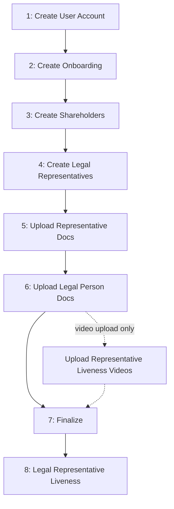

# Legal Person Onboarding

Complete flow for onboarding a Legal Person through the BaaS API.

## Flow Overview



Execute steps 1-7 in order. Step 8 happens while the onboarding is `IN_PROCESS`: every legal representative's liveness is verified either through an individual capture link or through a video you upload for each one. If you choose the video, upload one video per representative **before Step 7** (see [Step 8](#step-8-legal-representative-liveness)).

---

## Step 1: Create User Account

`POST /users/accounts`

Create user account as Legal Person with CNPJ.

**Returns:** `id`

**Note:** If a previous onboarding was **REJECTED** or **FAILED**, reuse the existing `id` and **skip to** [Step 2](#step-2-create-onboarding).

---

## Step 2: Create Onboarding

`POST /users/onboardings/legal-person`

Create onboarding record with legal person address and revenue.

**Returns:** `id` → Save for Steps 6, 7 and 8

**Note:** Cannot create if user already has an onboarding in any status other than REJECTED, FAILED or EXPIRED. Can create new if previous was REJECTED, FAILED or EXPIRED.

---

## Step 3: Create Shareholders

`POST /users/shareholders`

Register shareholders. Can be Natural Person (CPF) or Legal Person (CNPJ).

**Returns:** `id` → Save for Step 4

**Requirements:**
- At least one shareholder
- If shareholder is Natural Person (CPF), the `document` must match the legal representative's document created in Step 4
- Legal Person (CNPJ) shareholders must have at least one legal representative linked to them (validated at finalization)
- Total `participation_percentage` ≤ 100%

---

## Step 4: Create Legal Representatives

`POST /users/legal-representatives`

Register legal representatives. Must be Natural Person with CPF.

**Requires:** `shareholder_id` from Step 3

**Returns:** `id` → Save for Steps 5 and 8

**Requirements:**
- Must be Natural Person (CPF)
- Must link to a shareholder of the same onboarding via `shareholder_id` (Natural Person or Legal Person shareholder)
- If the linked shareholder is Natural Person, its `document` must match the representative's document
- At least one legal representative required

---

## Step 5: Upload Representative Documents

`POST /users/legal-representatives/{id}/documents`

Upload documents for each legal representative (multipart/form-data).

**Required:**
- `selfie` (file)
- `identity_document` (file)
- `identity_document_type` (enum: `id`, `cnh`, `passport`)
- `qualification_declaration` (file)

**Optional:**
- `income_declaration` (file)
- `address_proof` (file)

**Requirements:**
- Upload for ALL legal representatives
- Max 25 MB per file
- Formats: PDF, JPEG, JPG
- If the representatives' liveness will be verified by video (see [Step 8](#step-8-legal-representative-liveness)), send `identity_document` as a **JPEG image up to 5 MB** for every representative. A PDF or a larger image makes the finalization fail with `422` (`INVALID_FORMAT`)

---

## Step 6: Upload Legal Person Documents

`POST /users/onboardings/legal-person/{id}/documents`

Upload legal person documents. Call once per document type.

**Body:**
- `file` (binary)
- `type` (enum)

**Required types:**
- `SOCIAL_CONTRACT`
- `BALANCE_SHEET` OR `REVENUE_STATEMENT` (at least one)

**Optional:**
- `KYC_AML_POLICY`

**Requirements:**
- Max 10 MB per file
- Formats: PDF, JPEG, JPG

---

## Step 7: Finalize

`POST /users/onboardings/legal-person/{id}/finalize`

Submit onboarding for processing.

**Returns:** Status changes to `IN_PROCESS`

**Validation:**
- ✓ Onboarding exists and is in PENDING status
- ✓ At least one shareholder created
- ✓ At least one legal representative created
- ✓ All legal representatives are Natural Person
- ✓ All legal representatives linked to a shareholder of this onboarding
- ✓ Every Legal Person (CNPJ) shareholder has at least one linked legal representative
- ✓ All legal representatives have uploaded: selfie, identity_document, qualification_declaration
- ✓ Legal person has uploaded: SOCIAL_CONTRACT
- ✓ Legal person has uploaded: BALANCE_SHEET or REVENUE_STATEMENT
- ✓ Total shareholder participation does not exceed 100%
- ✓ If a liveness video was uploaded for any representative: every active representative has a video (`LEGAL_REPRESENTATIVE_LIVENESS_VIDEOS_INCOMPLETE`), every representative's `identity_document` is a JPEG image up to 5 MB (`INVALID_FORMAT`), and liveness is enabled for your product (`ONBOARDING_LIVENESS_NOT_REQUIRED`)

**If validation fails:** Returns `422` with error details. Fix and retry.

After finalization, the onboarding stays `IN_PROCESS` while the legal person data is analyzed and the legal representatives' liveness is verified (Step 8).

---

## Step 8: Legal Representative Liveness

While the onboarding is `IN_PROCESS`, every legal representative's liveness (facial capture) is verified individually. There are two ways to provide it:

| Method | How the capture happens | When you act |
|--------|------------------------|--------------|
| `LINK` (default) | Each representative completes the capture through a dedicated link we issue | After finalization, when the links are released |
| `VIDEO_UPLOAD` | You record each representative's liveness video and upload it | Before finalization (between Step 6 and Step 7) |

**The method is one or the other for the whole onboarding.** You never declare it: uploading a video for any representative selects `VIDEO_UPLOAD` for **all** of them, and finalization then requires one video per active representative. Without any video, every representative receives a link. The choice is locked at finalization — a first video is refused after that point (`422`, `LEGAL_REPRESENTATIVE_LIVENESS_METHOD_LOCKED`). The `method` field of the [progress endpoint](#checking-liveness-progress) tells which one is in effect.

**Note:** This step applies only when liveness is enabled for your product. If it is not enabled, the onboarding proceeds without this step, the liveness endpoints return `422`, and a finalization with uploaded videos is refused (`ONBOARDING_LIVENESS_NOT_REQUIRED`).

### Method A — Capture links

1. The legal person analysis is approved
2. An individual liveness link is created for every active legal representative
3. The `ONBOARDING_LEGAL_REPRESENTATIVE_LIVENESS_RELEASED` webhook delivers the links — normally all of them in a single notification
4. Deliver each link to its legal representative — the representative opens it and completes the facial capture
5. Each approval fires the `ONBOARDING_LEGAL_REPRESENTATIVE_LIVENESS_UPDATED` webhook with status `APPROVED`
6. Once every representative is approved, the onboarding proceeds toward `FINISHED`

**Integration rules:**
- Delivering each link to its representative is your responsibility — no notification is sent to them
- Links are individual per representative and do not expire
- The `RELEASED` webhook may be delivered more than once — the payload always carries the current full set of links, so process it idempotently and use the progress endpoint as the source of truth for who has a link
- `PENDING` with no `url` is normal, not an error — the legal person analysis has not been approved yet
- Do not wait for an intermediate webhook notification — with the links, only `APPROVED` is announced
- Treat `url` and `name` as sensitive data — the link grants access to the liveness capture and the name is personal data

### Method B — Video upload

`POST /v2/users/onboardings/{id}/legal-representatives/{legal_representative_id}/liveness/video`

Upload the liveness video of one legal representative, recorded by your own capture flow (multipart/form-data). Call it once per representative. Paths shown without a version prefix elsewhere in this guide are version 1 (`/v1/...`); this endpoint exists only in version 2.

**Availability:** video upload must be enabled for your integration. When it is not, the upload returns `422` (`ONBOARDING_LIVENESS_VIDEO_DISABLED`).

**When:** after the representative is created (Step 4) and **before** finalization (Step 7), while the onboarding is `PENDING`.

**Body:**
- `video` (file, required) — MP4 or MOV, max 50 MB
- `liveness_provider` (string, required, max 255) — name of the solution that recorded and verified the liveness (yours or a third party's)
- `liveness_provider_transaction_id` (string, required, max 255) — identifier of that capture at the provider, kept as an audit reference
- `captured_at` (string, required) — capture instant in `YYYY-MM-DDTHH:mm:ss.SSSZ` format (e.g. `2026-08-30T12:00:00.000Z`). It cannot be in the future and must be within the **last 24 hours**

**Returns (`201`):**
- `id` — liveness video ID
- `onboarding_id`
- `legal_representative_id`
- `file_id` — stored video file ID
- `state` — `UPLOADED` right after the upload; later `PROCESSING`, `COMPLETED` or `FAILED`
- `captured_at`, `created_at`

**How it works:**

1. Upload one video per active representative while the onboarding is `PENDING` — each upload fires `ONBOARDING_LEGAL_REPRESENTATIVE_LIVENESS_UPDATED` with status `PENDING` for that representative
2. Make sure every representative's `identity_document` (Step 5) is a JPEG image up to 5 MB
3. Finalize (Step 7) — the onboarding enters `IN_PROCESS`
4. Once the legal person analysis is approved, the videos are analysed. **No links are issued and no `RELEASED` webhook is sent**
5. Each representative's result arrives through `ONBOARDING_LEGAL_REPRESENTATIVE_LIVENESS_UPDATED`:
   - `APPROVED` — done for this representative
   - `REJECTED` — the onboarding becomes `REJECTED` (`ONBOARDING_REJECTED` webhook, with `rejected_legal_representative_id`); create a new onboarding
   - `IN_ANALYSIS` — further analysis is needed; wait for a later `APPROVED` or `REJECTED`
   - `WAITING_SUBMISSION` — the video could not be analysed; upload a new one for this representative
6. Once every representative is approved, the onboarding proceeds toward `FINISHED`

**Integration rules:**
- One video per representative. A new upload for a representative is accepted **only** while that representative's status is `WAITING_SUBMISSION` and the onboarding is still `IN_PROCESS` — otherwise the upload returns `422` (`ONBOARDING_LIVENESS_VIDEO_ALREADY_UPLOADED` or `ONBOARDING_LIVENESS_ALREADY_COMPLETED`)
- Methods cannot be mixed: once one representative has a video, representatives without one block the finalization (`LEGAL_REPRESENTATIVE_LIVENESS_VIDEOS_INCOMPLETE`)
- The result is asynchronous — do not resend while the status is `PENDING` or `IN_ANALYSIS`
- A closed (`FINISHED`, `REJECTED`, `FAILED`, `EXPIRED`) onboarding does not accept uploads

**Errors:**
- `400` — invalid parameters (e.g. malformed `captured_at`)
- `403` — onboarding does not belong to the authenticated user
- `422` — see the table below

| Code | Meaning |
|------|---------|
| `ONBOARDING_LIVENESS_VIDEO_DISABLED` | Video upload is not enabled for your integration |
| `LEGAL_REPRESENTATIVE_LIVENESS_METHOD_LOCKED` | Onboarding already finalized — a first video is no longer accepted |
| `ONBOARDING_LIVENESS_VIDEO_ALREADY_UPLOADED` | This representative already has a video that is not eligible for replacement |
| `ONBOARDING_LIVENESS_ALREADY_COMPLETED` | This representative's liveness was already concluded |
| `ONBOARDING_LIVENESS_VIDEO_TOO_OLD` | `captured_at` is older than 24 hours |
| `ONBOARDING_LIVENESS_VIDEO_CAPTURED_IN_FUTURE` | `captured_at` is in the future |
| `ONBOARDING_LIVENESS_NOT_REQUIRED` | Liveness is not enabled for this onboarding |
| `ONBOARDING_INVALID_STATUS` | The onboarding is closed and no longer accepts uploads |
| `USER_LEGAL_REPRESENTATIVE_NOT_FOUND` | The representative does not belong to this onboarding |
| `FILE_IS_REQUIRED`, `FILE_FORMAT`, `FILE_SIZE` | Missing video, unsupported format or file over 50 MB |

### Checking Liveness Progress

`GET /v2/users/onboardings/{id}/legal-representatives/liveness`

Lists every legal representative of the onboarding with their individual liveness progress and, for the link method, their link. Use it to know who is still pending.

**Response (array, one item per representative):**
- `id` — legal representative ID
- `name` — legal representative name
- `method` — `LINK` or `VIDEO_UPLOAD`
- `url` — individual liveness link (`LINK` only; absent while the link has not been created yet)
- `status` — liveness progress (see table below)
- `submitted_at` — when the representative submitted the liveness (absent while nothing was submitted)

| Status | `LINK` | `VIDEO_UPLOAD` | Action |
|--------|--------|----------------|--------|
| `PENDING` | No link yet — the legal person analysis still has to be approved | Video received, not analysed yet | Wait |
| `WAITING_SUBMISSION` | Link issued, the representative has not completed the liveness | No video for this representative yet (before finalization), or the video could not be analysed | Deliver the link / upload a video |
| `IN_ANALYSIS` | Submitted, result not confirmed yet | Video under analysis | Wait |
| `APPROVED` | Liveness completed | Liveness completed | Done for this representative |
| `REJECTED` | — | Liveness rejected; the onboarding becomes `REJECTED` | Create new onboarding |

With `VIDEO_UPLOAD`, the endpoint already answers before finalization once at least one video was sent, so you can check which representatives are still missing theirs.

**Webhooks:**

- `ONBOARDING_LEGAL_REPRESENTATIVE_LIVENESS_RELEASED` — all links created (`LINK` only), payload contains one entry per representative (`legal_representative_id`, `name`, `url`)
- `ONBOARDING_LEGAL_REPRESENTATIVE_LIVENESS_UPDATED` — per-representative progress, payload contains `legal_representative_id`, `status` and `submitted_at`. With the links only `APPROVED` is announced; with video upload every status change is announced. Use the endpoint above as the source of truth

**Integration rules:**
- If a representative fails identity verification, the onboarding becomes `REJECTED` and `rejected_legal_representative_id` in the status endpoint identifies which representative caused it

**Errors:**
- `422` — onboarding not found, not yet finalized without any video, or it does not require legal representative liveness
- `403` — onboarding does not belong to the authenticated user

---

## Checking Status

`GET /users/onboardings/legal-person/{id}`

Use this endpoint to check the current onboarding status.

**Status flow:**
```
PENDING → IN_PROCESS → FINISHED / REJECTED / FAILED
```

| Status | Meaning | Action |
|--------|---------|--------|
| `PENDING` | Incomplete | Complete steps 1-7 |
| `IN_PROCESS` | Processing — legal representatives may still need to complete liveness | Follow Step 8 |
| `FINISHED` | Approved | Proceed |
| `REJECTED` | Not approved | Create new onboarding |
| `FAILED` | Error | Contact support |
| `EXPIRED` | Onboarding expired after long inactivity | Create new onboarding |

**Webhooks:**

If webhooks are configured, you will receive notifications for:
- `ONBOARDING_LEGAL_REPRESENTATIVE_LIVENESS_RELEASED` - Liveness links created for all legal representatives
- `ONBOARDING_LEGAL_REPRESENTATIVE_LIVENESS_UPDATED` - Liveness progress of a legal representative
- `ONBOARDING_FINISHED` - Onboarding approved
- `ONBOARDING_REJECTED` - Onboarding not approved
- `ONBOARDING_FAILED` - Processing error

See [Webhooks](/baas/api-overview/webhooks) for payload examples and delivery details.

Configure webhooks to receive real-time notifications instead of polling this endpoint.

---

## Error Handling

**422 on finalization:**
- Response contains missing requirements
- Fix and retry

**REJECTED:**
- Create new onboarding with corrected data

**FAILED:**
- Contact support with onboarding ID
