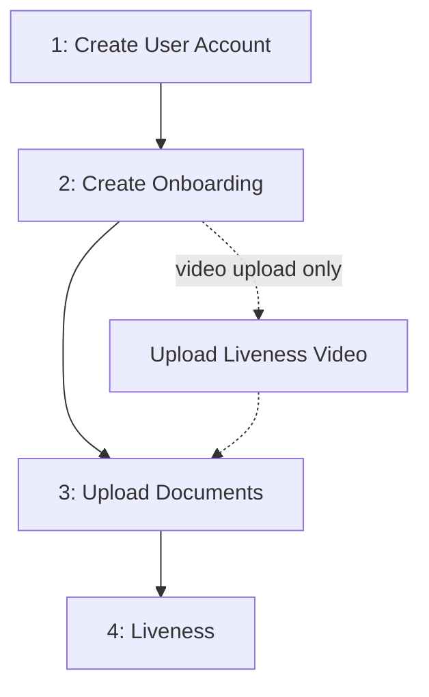

# Natural Person Onboarding

Complete flow for onboarding a Natural Person through the BaaS API.

## Flow Overview



Execute steps 1-3 in order. Step 4 happens while the onboarding is `IN_PROCESS`: the account holder's liveness is verified either through a capture link or through a video you upload. If you choose the video, upload it **between Step 2 and Step 3** (see [Step 4](#step-4-liveness)).

---

## Step 1: Create User Account

`POST /users/accounts`

Create user account as Natural Person with CPF.

**Returns:** `id`

**Note:** If a previous onboarding was **REJECTED** or **FAILED**, reuse the existing `id` and **skip to** [Step 2](#step-2-create-onboarding).

---

## Step 2: Create Onboarding

`POST /users/onboardings`

Create onboarding record with user address and personal data.

**Returns:** `id` → Save for Steps 3 and 4

**Body (required):**
- `address` (object): `zip_code`, `street`, `number`, `city`, `federative_unit`, `country` (required); `neighborhood`, `complement` (optional)
- `nationality` (string)
- `pep` (boolean)

**Body (optional):**
- `pep_since` (date, format: `YYYY-MM-DD`)
- `occupation_cbo_code` (number)
- `occupation_income` (number, R$ cents)
- `patrimony` (number, R$ cents)

**Note:** Cannot create if user already has an onboarding in any status other than REJECTED, FAILED or EXPIRED. Can create new if previous was REJECTED, FAILED or EXPIRED.

---

## Step 3: Upload Documents

`POST /users/onboardings/{id}/documents`

Upload documents (multipart/form-data). Two methods available:

**Method A — Physical document:**
- `selfie` (file, required)
- `document_front` (file, required)
- `document_back` (file, required)
- `document_file_type` (enum: `rg`, `cnh`, required)

**Method B — Digital identity:**
- `selfie` (file, required)
- `document_id` (string, required)

**Optional:**
- `address_proof` (file)

**Requirements:**
- Max 25 MB per file
- Choose one method (A or B), not both — sending `document_id` and `document_file_type` together is rejected
- If a liveness video was uploaded (see [Step 4](#step-4-liveness)), use **Method A** and send `document_front` as a **JPEG or PNG image up to 5 MB**. Otherwise the request that completes the documents is rejected with `422` (`INVALID_FORMAT`)

Once all required documents are received, the onboarding enters `IN_PROCESS`.

---

## Step 4: Liveness

While the onboarding is `IN_PROCESS`, the account holder's liveness (facial capture) is verified. There are two ways to provide it:

| Method | How the capture happens | When you act |
|--------|------------------------|--------------|
| `LINK` (default) | The holder completes the capture through a dedicated link we issue | After the documents, when the link is released |
| `VIDEO_UPLOAD` | You record the holder's liveness video and upload it | Before the documents (between Step 2 and Step 3) |

You never declare the method: uploading a video selects `VIDEO_UPLOAD`; otherwise the onboarding uses `LINK`. The choice is locked once the documents are complete — a first video is refused after that point (`422`, `ONBOARDING_LIVENESS_METHOD_LOCKED`). The `method` field of the [progress endpoint](#checking-liveness-progress) tells which one is in effect.

**Note:** This step applies only when liveness is enabled for your product. If it is not enabled, the onboarding proceeds without this step, the liveness endpoints return `422` and a video upload is refused (`ONBOARDING_LIVENESS_NOT_REQUIRED`).

### Method A — Capture link

1. Documents are received and the onboarding enters `IN_PROCESS`
2. A liveness link is created for the account holder
3. The `ONBOARDING_NATURAL_PERSON_LIVENESS_RELEASED` webhook delivers the link
4. Deliver the link to the account holder — they open it and complete the facial capture
5. The approval fires the `ONBOARDING_NATURAL_PERSON_LIVENESS_UPDATED` webhook with status `APPROVED`
6. The onboarding proceeds toward `FINISHED`

**Integration rules:**
- Delivering the link to the account holder is your responsibility — no notification is sent to them
- The link does not expire
- The `RELEASED` webhook may be delivered more than once — the payload always carries the current link, so process it idempotently and use the progress endpoint as the source of truth
- Do not wait for an intermediate webhook notification — with the link, only `APPROVED` is announced
- Treat `url` and `name` as sensitive data — the link grants access to the liveness capture and the name is personal data

### Method B — Video upload

`POST /v2/users/onboardings/{id}/liveness/video`

Upload a liveness video recorded by your own capture flow (multipart/form-data). Paths shown without a version prefix elsewhere in this guide are version 1 (`/v1/...`); this endpoint exists only in version 2.

**Availability:** video upload must be enabled for your integration. When it is not, the upload returns `422` (`ONBOARDING_LIVENESS_VIDEO_DISABLED`).

**When:** after Step 2 and **before** the documents of Step 3 are complete (onboarding still `PENDING`).

**Body:**
- `video` (file, required) — MP4 or MOV, max 50 MB
- `liveness_provider` (string, required, max 255) — name of the solution that recorded and verified the liveness (yours or a third party's)
- `liveness_provider_transaction_id` (string, required, max 255) — identifier of that capture at the provider, kept as an audit reference
- `captured_at` (string, required) — capture instant in `YYYY-MM-DDTHH:mm:ss.SSSZ` format (e.g. `2026-08-30T12:00:00.000Z`). It cannot be in the future and must be within the **last 24 hours**

**Returns (`201`):**
- `id` — liveness video ID
- `onboarding_id`
- `file_id` — stored video file ID
- `state` — `UPLOADED` right after the upload; later `PROCESSING`, `COMPLETED` or `FAILED`
- `captured_at`, `created_at`

**How it works:**

1. Upload the video while the onboarding is `PENDING` — the `ONBOARDING_NATURAL_PERSON_LIVENESS_UPDATED` webhook announces status `PENDING`
2. Upload the documents (Step 3, Method A, `document_front` as JPEG or PNG up to 5 MB) — the onboarding enters `IN_PROCESS` and the video analysis starts. **No link is issued and no `RELEASED` webhook is sent**
3. The result arrives through `ONBOARDING_NATURAL_PERSON_LIVENESS_UPDATED`:
   - `APPROVED` — the onboarding proceeds toward `FINISHED`
   - `REJECTED` — the onboarding becomes `REJECTED` (`ONBOARDING_REJECTED` webhook); create a new onboarding
   - `IN_ANALYSIS` — further analysis is needed; wait for a later `APPROVED` or `REJECTED`
   - `WAITING_SUBMISSION` — the video could not be analysed; upload a new one

**Integration rules:**
- One video per onboarding. A new upload is accepted **only** while the progress status is `WAITING_SUBMISSION` and the onboarding is still `IN_PROCESS` — otherwise the upload returns `422` (`ONBOARDING_LIVENESS_VIDEO_ALREADY_UPLOADED` or `ONBOARDING_LIVENESS_ALREADY_COMPLETED`)
- The video method is not compatible with digital identity (Step 3, Method B): the front of the physical identity document is required
- The result is asynchronous — do not resend while the status is `PENDING` or `IN_ANALYSIS`
- A closed (`FINISHED`, `REJECTED`, `FAILED`, `EXPIRED`) onboarding does not accept uploads

**Errors:**
- `400` — invalid parameters (e.g. malformed `captured_at`)
- `403` — onboarding does not belong to the authenticated user
- `422` — see the table below

| Code | Meaning |
|------|---------|
| `ONBOARDING_LIVENESS_VIDEO_DISABLED` | Video upload is not enabled for your integration |
| `ONBOARDING_LIVENESS_METHOD_LOCKED` | Documents already complete — a first video is no longer accepted |
| `ONBOARDING_LIVENESS_VIDEO_ALREADY_UPLOADED` | A video was already sent and is not eligible for replacement |
| `ONBOARDING_LIVENESS_ALREADY_COMPLETED` | The liveness of this onboarding was already concluded |
| `ONBOARDING_LIVENESS_VIDEO_TOO_OLD` | `captured_at` is older than 24 hours |
| `ONBOARDING_LIVENESS_VIDEO_CAPTURED_IN_FUTURE` | `captured_at` is in the future |
| `ONBOARDING_LIVENESS_NOT_REQUIRED` | Liveness is not enabled for this onboarding |
| `ONBOARDING_INVALID_STATUS` | The onboarding is closed and no longer accepts uploads |
| `FILE_IS_REQUIRED`, `FILE_FORMAT`, `FILE_SIZE` | Missing video, unsupported format or file over 50 MB |

### Checking Liveness Progress

`GET /v2/users/onboardings/{id}/liveness`

Returns the account holder's liveness progress and, for the link method, the link.

**Response:**
- `method` — `LINK` or `VIDEO_UPLOAD`
- `url` — liveness link (`LINK` only; absent while the link has not been created yet)
- `status` — liveness progress (see table below)
- `submitted_at` — when the liveness was submitted (absent while nothing was submitted)

| Status | `LINK` | `VIDEO_UPLOAD` | Action |
|--------|--------|----------------|--------|
| `PENDING` | No link yet | Video received, documents not complete yet | Wait / complete Step 3 |
| `WAITING_SUBMISSION` | Link issued, the holder has not completed the liveness | The video could not be analysed | Deliver the link / upload a new video |
| `IN_ANALYSIS` | Submitted, result not confirmed yet | Video under analysis | Wait |
| `APPROVED` | Liveness completed | Liveness completed | Done |
| `REJECTED` | — | Liveness rejected; the onboarding becomes `REJECTED` | Create new onboarding |

**Webhooks:**

- `ONBOARDING_NATURAL_PERSON_LIVENESS_RELEASED` — link created (`LINK` only), payload contains `name` and `url`
- `ONBOARDING_NATURAL_PERSON_LIVENESS_UPDATED` — liveness progress, payload contains `status` and `submitted_at`. With the link only `APPROVED` is announced; with video upload every status change is announced. Use the endpoint above as the source of truth

**Errors:**
- `422` — onboarding not found, still `PENDING` without a video, or it does not require liveness
- `403` — onboarding does not belong to the authenticated user

---

## Checking Status

`GET /users/onboardings/{id}`

Use this endpoint to check the current onboarding status.

**Status flow:**
```
PENDING → IN_PROCESS → FINISHED / REJECTED / FAILED
```

| Status | Meaning | Action |
|--------|---------|--------|
| `PENDING` | Awaiting documents | Complete step 3 |
| `IN_PROCESS` | Documents received, under analysis — the holder may still need to complete liveness | Follow Step 4 |
| `FINISHED` | Approved | Proceed |
| `REJECTED` | Not approved | Create new onboarding |
| `FAILED` | Error | Contact support |
| `EXPIRED` | Onboarding expired after long inactivity | Create new onboarding |

**Webhooks:**

If webhooks are configured, you will receive notifications for:
- `ONBOARDING_NATURAL_PERSON_LIVENESS_RELEASED` - Liveness link created for the account holder
- `ONBOARDING_NATURAL_PERSON_LIVENESS_UPDATED` - Liveness progress of the account holder
- `ONBOARDING_FINISHED` - Onboarding approved
- `ONBOARDING_REJECTED` - Onboarding not approved
- `ONBOARDING_FAILED` - Processing error

See [Webhooks](/baas/api-overview/webhooks) for payload examples and delivery details.

Configure webhooks to receive real-time notifications instead of polling this endpoint.

---

## Error Handling

**REJECTED:**
- Create new onboarding with corrected data

**FAILED:**
- Contact support with onboarding ID
