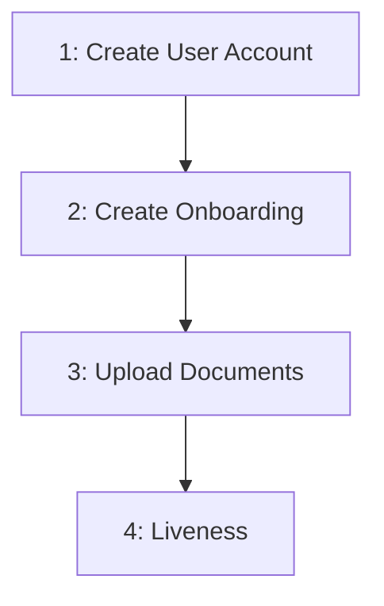

# Natural Person Onboarding

Complete flow for onboarding a Natural Person through the BaaS API.

## Flow Overview



Execute steps 1-3 in order. Step 4 happens while the onboarding is `IN_PROCESS`: the account holder completes a liveness check.

---

## Step 1: Create User Account

`POST /users/accounts`

Create user account as Natural Person with CPF.

**Returns:** `id`

**Note:** If a previous onboarding was **REJECTED** or **FAILED**, reuse the existing `id` and **skip to** [Step 2](#step-2-create-onboarding).

---

## Step 2: Create Onboarding

`POST /users/onboardings`

Create onboarding record with user address and personal data.

**Returns:** `id` → Save for Steps 3 and 4

**Body (required):**
- `address` (object): `zip_code`, `street`, `number`, `city`, `federative_unit`, `country` (required); `neighborhood`, `complement` (optional)
- `nationality` (string)
- `pep` (boolean)

**Body (optional):**
- `pep_since` (date, format: `YYYY-MM-DD`)
- `occupation_cbo_code` (number)
- `occupation_income` (number, R$ cents)
- `patrimony` (number, R$ cents)

**Note:** Cannot create if user already has an onboarding in any status other than REJECTED, FAILED or EXPIRED. Can create new if previous was REJECTED, FAILED or EXPIRED.

---

## Step 3: Upload Documents

`POST /users/onboardings/{id}/documents`

Upload documents (multipart/form-data). Two methods available:

**Method A — Physical document:**
- `selfie` (file, required)
- `document_front` (file, required)
- `document_back` (file, required)
- `document_file_type` (enum: `rg`, `cnh`, required)

**Method B — Digital identity:**
- `selfie` (file, required)
- `document_id` (string, required)

**Optional:**
- `address_proof` (file)

**Requirements:**
- Max 25 MB per file
- Choose one method (A or B), not both — sending `document_id` and `document_file_type` together is rejected

---

## Step 4: Liveness

While the onboarding is `IN_PROCESS`, the account holder must complete a liveness check (facial capture) through a dedicated link.

**Note:** This step applies only when liveness is enabled for your product. If it is not enabled, the onboarding proceeds without this step and the liveness endpoint returns `422`.

**How it works:**

1. Documents are received and the onboarding enters `IN_PROCESS`
2. A liveness link is created for the account holder
3. The `ONBOARDING_NATURAL_PERSON_LIVENESS_RELEASED` webhook delivers the link
4. Deliver the link to the account holder — they open it and complete the facial capture
5. The approval fires the `ONBOARDING_NATURAL_PERSON_LIVENESS_UPDATED` webhook with status `APPROVED`
6. The onboarding proceeds toward `FINISHED`

### Checking Liveness Progress

`GET /users/onboardings/{id}/liveness`

Returns the account holder's liveness link and progress for the onboarding.

**Response:**
- `url` — liveness link (absent while the link has not been created yet)
- `status` — liveness progress (see table below)
- `submitted_at` — when the holder submitted the liveness (absent while nothing was submitted)

| Status | Meaning | Action |
|--------|---------|--------|
| `PENDING` | No link yet | Wait |
| `WAITING_SUBMISSION` | Link issued, the holder has not completed the liveness | Deliver the link to the holder |
| `IN_ANALYSIS` | Submitted, result not confirmed yet | Wait |
| `APPROVED` | Liveness completed | Done |

**Webhooks:**

- `ONBOARDING_NATURAL_PERSON_LIVENESS_RELEASED` — link created, payload contains `name` and `url`
- `ONBOARDING_NATURAL_PERSON_LIVENESS_UPDATED` — liveness progress, payload contains `status` and `submitted_at`. Only `APPROVED` is announced — poll the endpoint above for intermediate statuses

**Integration rules:**
- Delivering the link to the account holder is your responsibility — no notification is sent to them
- The link does not expire
- The `RELEASED` webhook may be delivered more than once — the payload always carries the current link, so process it idempotently and use the progress endpoint as the source of truth
- Do not wait for an intermediate webhook notification — only `APPROVED` is announced
- Treat `url` and `name` as sensitive data — the link grants access to the liveness capture and the name is personal data

**Errors:**
- `422` — onboarding not found, still `PENDING`, or it does not require liveness
- `403` — onboarding does not belong to the authenticated user

---

## Checking Status

`GET /users/onboardings/{id}`

Use this endpoint to check the current onboarding status.

**Status flow:**
```
PENDING → IN_PROCESS → FINISHED / REJECTED / FAILED
```

| Status | Meaning | Action |
|--------|---------|--------|
| `PENDING` | Awaiting documents | Complete step 3 |
| `IN_PROCESS` | Documents received, under analysis — the holder may still need to complete liveness | Follow Step 4 |
| `FINISHED` | Approved | Proceed |
| `REJECTED` | Not approved | Create new onboarding |
| `FAILED` | Error | Contact support |
| `EXPIRED` | Onboarding expired after long inactivity | Create new onboarding |

**Webhooks:**

If webhooks are configured, you will receive notifications for:
- `ONBOARDING_NATURAL_PERSON_LIVENESS_RELEASED` - Liveness link created for the account holder
- `ONBOARDING_NATURAL_PERSON_LIVENESS_UPDATED` - The account holder completed the liveness
- `ONBOARDING_FINISHED` - Onboarding approved
- `ONBOARDING_REJECTED` - Onboarding not approved
- `ONBOARDING_FAILED` - Processing error

See [Webhooks](/baas/api-overview/webhooks) for payload examples and delivery details.

Configure webhooks to receive real-time notifications instead of polling this endpoint.

---

## Error Handling

**REJECTED:**
- Create new onboarding with corrected data

**FAILED:**
- Contact support with onboarding ID
