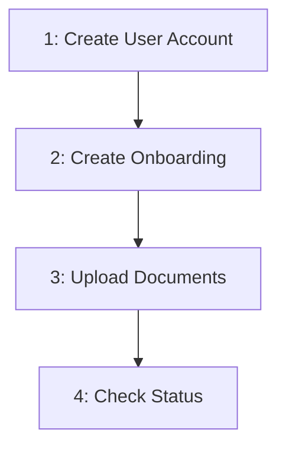

# Natural Person Onboarding

Complete flow for onboarding a Natural Person through the BaaS API.

## Flow Overview



Execute steps 1-3 in order. Step 4 is for checking the result.

---

## Step 1: Create User Account

`POST /users/accounts`

Create user account as Natural Person with CPF.

**Returns:** `user_id`

**Note:** If a previous onboarding was **REJECTED** or **FAILED**, reuse the existing `user_id` and **skip to** [Step 2](#step-2-create-onboarding).

---

## Step 2: Create Onboarding

`POST /users/onboardings`

Create onboarding record with user address and personal data.

**Returns:** `onboarding_id` → Save for Steps 3 and 4

**Body (required):**
- `address` (object): `zip_code`, `street`, `number`, `city`, `federative_unit`, `country` (required); `neighborhood`, `complement` (optional)
- `nationality` (string)
- `pep` (boolean)

**Body (optional):**
- `pep_since` (date, format: `YYYY-MM-DD`)
- `occupation_cbo_code` (number)
- `occupation_income` (number, R$ cents)
- `patrimony` (number, R$ cents)

**Note:** Cannot create if user has active onboarding (PENDING, FINISHED). Can create new if previous was REJECTED or FAILED.

---

## Step 3: Upload Documents

`POST /users/onboardings/{id}/documents`

Upload documents (multipart/form-data). Two methods available:

**Method A — Physical document:**
- `selfie` (file, required)
- `document_front` (file, required)
- `document_back` (file, required)
- `document_file_type` (enum: `rg`, `cnh`, required)

**Method B — Digital identity:**
- `selfie` (file, required)
- `document_id` (string, required)

**Optional:**
- `address_proof` (file)

**Requirements:**
- Max 25 MB per file
- Choose one method (A or B), not both

---

## Step 4: Check Status

`GET /users/onboardings/{id}`

Use this endpoint to check the current onboarding status.

**Status flow:**
```
PENDING → FINISHED / REJECTED / FAILED
```

| Status | Meaning | Action |
|--------|---------|--------|
| `PENDING` | Awaiting documents or processing | Complete step 3 or wait |
| `FINISHED` | Approved | Proceed |
| `REJECTED` | Not approved | Create new onboarding |
| `FAILED` | Error | Contact support |

**Webhooks:**

If webhooks are configured, you will receive notifications for:
- `FINISHED` - Onboarding approved
- `REJECTED` - Onboarding not approved

Configure webhooks to receive real-time notifications instead of polling this endpoint.

---

## Error Handling

**REJECTED:**
- Create new onboarding with corrected data

**FAILED:**
- Contact support with onboarding ID
