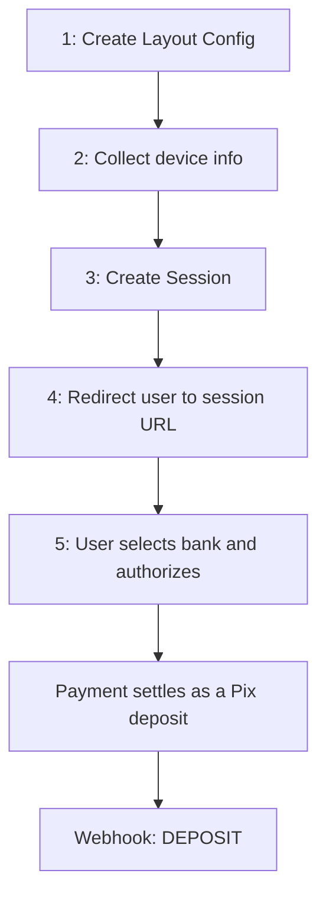

# Open Finance Payments

Let your end user pay you by authorizing a Pix payment directly from their account at another bank, using Open Finance instead of a copy-pasted Pix key or QR code.

## Prerequisite

You will need:
- an authenticated user with a finished onboarding, whose wallet's own bank account is **active** — that account is where the payment lands
- `x-wallet-uuid` header on every request
- `nonce` header on every request
- `x-transaction-uuid` header on the two `POST` requests (create layout config, create session)

---

## Flow Overview



Step 1 is a one-time setup per wallet. Steps 2 to 5 happen on every payment.

---

## Step 1: Create the Layout Config

`POST /open-finance/layout-configs`

Configure how the hosted Open Finance payment page looks, and where the user is sent back to once the flow ends.

**Required body:**
- `logo_url` (string)
- `background_color` (string, hex color)
- `button_color` (string, hex color)
- `redirect_url` (string) — where the user is redirected after finishing the flow, whether the payment succeeds or not

```json
{
  "logo_url": "https://example.com/logo.png",
  "background_color": "#000000",
  "button_color": "#000000",
  "redirect_url": "https://example.com/redirect"
}
```

**Returns:** `id`, `status` (`ACTIVE` by default), `created_at`

**Important:**
- Only **one** layout config exists per wallet — creating a second one is rejected with `422`
- Creating a session (Step 3) requires an `ACTIVE` layout config for the wallet. If none exists, or it is `INACTIVE`, session creation fails with `422`

This is a one-time integration step — do it once, then reuse it for every payment.

### Managing the Layout Config

- `GET /open-finance/layout-configs/{id}` → read the current config: `logo_url`, `background_color`, `button_color`, `redirect_url`, `status`
- `PATCH /open-finance/layout-configs/{id}` → update any visual field, or toggle `enabled` to activate/deactivate it without deleting it
- `DELETE /open-finance/layout-configs/{id}` → remove it; a new one can be created afterward

```json
{
  "enabled": false
}
```

Set `enabled: false` to stop accepting new Open Finance sessions temporarily, without losing the visual configuration. Set it back to `true` to resume.

---

## Step 2: Collect the User's Device Information

Every session requires a `device_risk_signal` object describing the device the end user is paying from. Collect it on the client (app or browser) right before creating the session — it is not something your backend can source on its own.

**Required fields:**

| Field | Type | Description |
|---|---|---|
| `device_id` | string | Device identifier |
| `os_version` | string | Operating system version |
| `user_time_zone_offset` | string | e.g. `-03:00` |
| `language` | string | ISO 639-1 code, e.g. `pt` |
| `screen_width` | number | Screen width in pixels |
| `screen_height` | number | Screen height in pixels |

**Optional fields:** `elapsed_time_since_boot`, `is_rooted_device`, `screen_brightness`, `device_latitude`, `device_longitude`, `device_geolocation_type` (`COARSE`, `FINE`, `INFERRED`), `is_call_in_progress`, `is_dev_mode_enabled`, `is_mock_gps`, `is_emulated`, `is_monkey_runner`, `is_charging`, `antenna_information`, `is_usb_connected`, `device_app_integrity_verdict`, `device_integrity_verdict`

**Where to find this natively:**

| Field(s) | Android | iOS |
|---|---|---|
| `os_version`, `device_id` | [`Build`](https://developer.android.com/reference/android/os/Build) | [`UIDevice`](https://developer.apple.com/documentation/uikit/uidevice) |
| `screen_width`, `screen_height`, `screen_brightness` | [`DisplayMetrics`](https://developer.android.com/reference/android/util/DisplayMetrics) | [`UIScreen`](https://developer.apple.com/documentation/uikit/uiscreen) |
| `device_latitude`, `device_longitude`, `device_geolocation_type` | [Location docs](https://developer.android.com/training/location) | [Core Location](https://developer.apple.com/documentation/corelocation) |
| `device_app_integrity_verdict`, `device_integrity_verdict` | [Play Integrity API](https://developer.android.com/google/play/integrity) | [DeviceCheck / App Attest](https://developer.apple.com/documentation/devicecheck) |

**Important — this data is never stored.** `device_risk_signal` exists only for the lifetime of the session created in Step 3: it is cached to evaluate the payment's risk and is discarded once the session expires. It is not persisted as part of your account's data and is not returned by any endpoint afterward.

---

## Step 3: Create the Session

`POST /open-finance/sessions`

**Required body:**
- `logged_user_document` (string, CPF) — document of the end user making the payment
- `amount` (integer, BRL cents)
- `device_risk_signal` (object, see Step 2)

**Optional body:**
- `logged_business_entity_document` (string, CNPJ) — send it when the payer is a business entity; `logged_user_document` is then the document of its legal representative

```json
{
  "logged_user_document": "40995401039",
  "amount": 100,
  "device_risk_signal": {
    "device_id": "00aa11bb22cc33dd",
    "os_version": "14",
    "user_time_zone_offset": "-03:00",
    "language": "pt",
    "screen_width": 1080,
    "screen_height": 1920
  }
}
```

**Returns:** `url` — the Open Finance session URL

**Important:**
- Redirect the user (browser or webview) to `url` right after creating the session — the session stays valid for a limited window, and the user can complete the payment at any point within it, not necessarily right when the session was created. Once the window elapses, the URL stops working and a new session must be created with fresh device data
- By default, sending the exact same body again — even for a different `nonce` — is treated as a repeated request and gets blocked for 2 hours. To create another session with the same data (retry, or the same user paying again right away), send `x-include-replay-protection-schema: nonce` and a different `nonce` value. See [Replay Protection](/baas/api-overview/replay)
- The account receiving the payment is your wallet's own registered bank account, which must be **active**, or the request fails with `422`

---

## Step 4: User Completes the Payment

On the session page, the user picks their bank (the Open Finance participant), authorizes the payment from their own account, and is redirected back to the `redirect_url` configured in Step 1 once the flow ends.

You do not call any endpoint for this step — it happens entirely on the hosted session page. Nothing needs to be polled either: move to Step 5 and wait for the webhook.

---

## Step 5: Confirm the Payment

An Open Finance payment settles into your wallet the same way any other Pix payment received does: as a Pix deposit. There is no Open Finance–specific webhook — you get the same `DEPOSIT` event you already use for regular Pix deposits.

```json
{
  "id": "a839f358-0e39-409e-b9a5-5a56b18ba3f2",
  "type": "DEPOSIT",
  "end_to_end_id": "E26264220202404171333Hq7F9SWyvUE",
  "txid": null,
  "operation_id": "7da84c17-d40c-5bc1-9b69-867d1460736b",
  "amount": "100",
  "owner_name": "Full Name",
  "owner_person_type": "CPF",
  "owner_document": "***995401**",
  "owner_bank_name": "BANK NAME S/A",
  "owner_bank_ispb": "00000000",
  "owner_branch_number": "0000",
  "owner_account_number": "000000",
  "owner_account_type": "CACC",
  "beneficiary_name": "Your Company",
  "beneficiary_account_number": "000000",
  "beneficiary_branch_number": "0000",
  "beneficiary_person_type": "CNPJ",
  "beneficiary_document": "00000000000000",
  "beneficiary_bank_name": "ZERO IP S/A",
  "beneficiary_bank_ispb": "26264220",
  "created_at": "2024-04-17T13:33:41.071Z"
}
```

**Important:** the payload does not carry a reference back to the session that originated it, and `created_at` is when the deposit was received — not a fixed instant tied to when you created the session, since the payment can be completed at any point during the session's validity window (Step 3). Reconciliation relies on `owner_document` and `amount`, not the date.

By default, `owner_document` is delivered **masked** (as in the example above). If your integration needs to reconcile Open Finance payments with certainty, contact your Zro representative to request this field unmasked for your account.

See [Webhooks](/baas/api-overview/webhooks) for the full payload reference and delivery details.

---

## Minimal Integration Sequence

1. `POST /open-finance/layout-configs` once, when enabling Open Finance for your wallet.
2. On each payment: collect `device_risk_signal` on the user's device (Step 2).
3. `POST /open-finance/sessions` with the user's document, the amount, and the device data.
4. Redirect the user to the returned `url`.
5. Wait for the `DEPOSIT` webhook to confirm the payment.

---

## Error Handling

**422 on create session:**
- No `ACTIVE` layout config exists for the wallet — create one (Step 1) or reactivate it with `enabled: true`
- The wallet's own bank account is not active

**422 on create layout config:**
- A layout config already exists for the wallet — use `PATCH`/`DELETE` instead of creating a new one

**401:**
- User authentication failed
