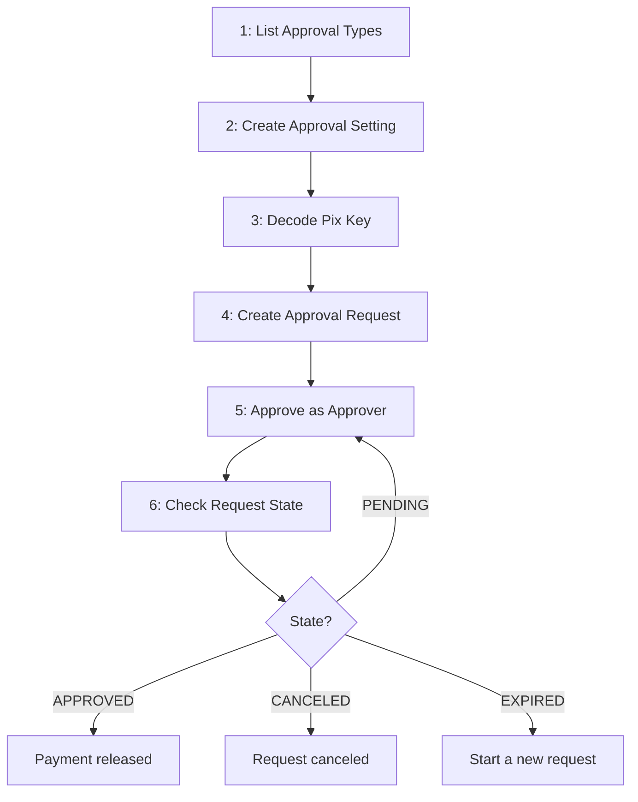

# Transaction Approval

Flow to require multiple approvals before a Pix payment is executed in BaaS API.

Instead of sending a Pix payment directly, the payer creates a **transaction approval request**. The payment is only released after the approvers registered in the wallet cast enough approval votes.

## Prerequisite

You will need:
- an authenticated user with a finished onboarding
- `x-wallet-uuid` header on every request
- `nonce` header on every request
- `x-transaction-uuid` header on every write request (create, approve, cancel, delete)
- the approver users already registered in the wallet

**Approver setup is out of scope for the BaaS API.** The approval roles are wallet permission types (`APPROVER` and `APPROVER_MASTER`) and are assigned through the users API with `PUT /operations/permissions`, body `{ "user_id": "...", "permission_types": ["APPROVER_MASTER"] }`. Available tags can be listed with `GET /operations/permissions/types`. Assign the roles before creating a setting that requires master approval, otherwise no user will be able to vote.

---

## Flow Overview



Steps 1 and 2 are executed once, when configuring the wallet. Steps 3 to 6 are executed on every payment that falls under the setting.

---

## Approval Rules

A request is approved when the votes match the setting. Votes are counted by the permission type of the voting user, and `approver_master_required` decides whether master votes are counted apart.

| `approver_master_required` | How votes are counted | Approval condition |
|---|---|---|
| `false` (or omitted) | single counter — the voter's role is not considered | total votes >= `approvers_quantity` |
| `true` | two counters — `APPROVER` and the wallet owner fill the common count, `APPROVER_MASTER` fills the master count | common votes >= `approvers_quantity` **and** master votes >= `approver_master_quantity` |

Eligibility to vote is the same in both cases — `APPROVER`, `APPROVER_MASTER`, and the wallet owner. The flag changes only how the votes are counted.

**How a vote is classified:**
- user has the `APPROVER_MASTER` tag → counted as a **master vote**
- user is the wallet owner → counted as a **common vote** (`ROOT`)
- user has the `APPROVER` tag → counted as a **common vote**
- none of the above → `403`, regardless of `approver_master_required`

Voting is granted to the `APPROVER` and `APPROVER_MASTER` permission types only. `CLIENT` and `ADMIN` cannot vote even when master approval is not required.

The wallet owner is identified by user id, not by tag, so they can vote without being assigned `APPROVER` — unless they also hold `APPROVER_MASTER`, in which case their vote counts as a master vote. `APPROVER_MASTER` always takes precedence over the other classifications.

**Numeric example** — setting with `approvers_quantity: 2`, `approver_master_required: true`, `approver_master_quantity: 1`:

| Votes cast | Common | Master | State |
|---|---|---|---|
| 2 approvers | 2 | 0 | `PENDING` — master vote still missing |
| 1 approver + 1 master | 1 | 1 | `PENDING` — one common vote still missing |
| 2 approvers + 1 master | 2 | 1 | `APPROVED` |

Master votes do not count toward `approvers_quantity`. Size the setting accordingly: the example above needs **three** distinct voters.

**Sizing warning.** Assigning `APPROVER_MASTER` to the wallet owner removes their common vote — the master classification wins, so they stop filling the `approvers_quantity` count. A wallet with only an owner (also master) and one `APPROVER` can never satisfy `approvers_quantity: 2`, and the request stays `PENDING` until it expires. Nothing validates this when the setting is created: each vote still returns `201`. Make sure the wallet has enough distinct voters in each category before choosing the quantities.

---

## Step 1: List Approval Types

`GET /permissions/transaction-approval-types`

List the transaction types that support the approval flow. Use it to confirm that the transaction type you want to protect is available.

**Optional query params:** `page`, `size`, `sort`, `order`

**Returns per item:** `id`, `transaction_type_id`, `transaction_type_tag`, `description`, `created_at`

---

## Step 2: Create the Approval Setting

`POST /permissions/transaction-approval-settings/pix-payment`

Create the rule that decides when a Pix payment of this wallet requires approval. Transaction type and currency are fixed by the endpoint — you do not send them.

**Only the wallet owner can create or delete a setting.** No permission type grants these two endpoints, so an `APPROVER`, `CLIENT`, or `ADMIN` user receives `403`.

**Required body:**
- `approvers_quantity` (integer, 1 to 100)
- `min_amount` (BRL cents, positive) → payments from this amount on require approval

**Optional body:**
- `approver_master_required` (boolean)
- `approver_master_quantity` (integer, 1 to 100) → **required when `approver_master_required` is `true`**

```json
{
  "approvers_quantity": 2,
  "min_amount": 100000000,
  "approver_master_required": true,
  "approver_master_quantity": 1
}
```

**Returns:** `id`, `created_at`

**Important:**
- `approver_master_required = true` without `approver_master_quantity` is rejected
- Only **one** setting exists per wallet, currency, and transaction type. Creating a second one is rejected
- Settings cannot be edited. To change the quantities, delete the current setting and create a new one

See [Approval Rules](#approval-rules) before choosing the quantities.

### Replacing a Setting

`DELETE /permissions/transaction-approval-settings/{id}`

Settings are immutable — to change the quantities or `min_amount`, delete the current setting and create a new one. Wallet owner only. The request is rejected while the setting still has `PENDING` approval requests, so cancel or wait for them first.

---

## Step 3: Decode the Pix Key

`POST /pix/payments/decode/by-key`

Decode the destination Pix key and save the returned `id`. The approval request references the decoded key instead of the raw key.

---

## Step 4: Create the Approval Request

`POST /permissions/transaction-approval-requests/pix-payment-by-key`

Create the approval request for a Pix payment by key. This replaces the direct payment call when the amount falls under an existing setting.

**Required body:**
- `decoded_pix_key_id` (from Step 3)
- `value` (BRL cents, positive)

**Optional body:**
- `payment_date` (`YYYY-MM-DD`, today or later)
- `description`

**Returns:** `id`, `render_request_body`, `state`, `created_at`

**Expected initial state:** `PENDING`

Use `render_request_body` to display the pending payment to the approvers: it carries the payment data in a presentation-ready shape.

---

## Step 5: Approve the Request

`POST /permissions/transaction-approvals`

Each approver calls this endpoint once. One call is one approval vote.

**Required body:**
- `transaction_approval_request_id`

**Returns:** `id`, `created_at`

**Integration rules:**
- The endpoint is called by the **approver**, authenticated as themselves — not by the payer
- There is no reject endpoint. To refuse a payment, cancel the request (Step 7)
- Only `PENDING` requests accept votes
- When the last required vote arrives, the request moves to `APPROVED` and the payment is released

---

## Step 6: Check the Request State

`GET /permissions/transaction-approval-requests/{id}`

Source of truth for the current state of the request.

**Returns:** `id`, `user_name`, `transaction_approval_setting_id`, `render_request_body`, `amount`, `transaction_type_tag`, `state`, `votes`, `approvers_quantity`, `created_at`

**There is no webhook for transaction approvals.** Poll this endpoint to follow the request.

| State | Meaning | Action |
|---|---|---|
| `PENDING` | Waiting for the remaining approval votes | Keep polling, or have the missing approvers call Step 5 |
| `APPROVED` | Every required vote was cast | Payment released. Follow it through the Pix payment endpoints |
| `CANCELED` | Canceled by a user of the wallet | Create a new request if the payment is still needed |
| `EXPIRED` | Not approved by the end of the payment date. A daily job expires the pending requests whose `payment_date` was the previous day | Create a new request |

**Scheduled payments:** expiration is keyed on the payment date, not on the creation date. A request created without `payment_date` uses the creation date, so it expires the day after it is created. A request scheduled for a future date stays `PENDING` and keeps accepting votes until the day after that date.

**Reading `votes`:** it is the total number of votes cast, master and common together. When `approver_master_required` is `true`, `votes >= approvers_quantity` alone does **not** mean the request is approved — use `state`, and `GET /permissions/transaction-approvals` if you need the breakdown.

---

## Step 7: Cancel the Request

`DELETE /permissions/transaction-approval-requests/{id}`

Cancel a request that should not be paid. This is how a payment is refused.

Any user with access to the wallet can cancel — not only the user who created the request. Only `PENDING` requests can be canceled.

**Returns:** `id`, `user_name`, `transaction_approval_setting_id`, `render_request_body`, `amount`, `transaction_type_tag`, `state`, `votes`, `created_at`

**Resulting state:** `CANCELED`

---

## Minimal Integration Sequence

1. `GET /permissions/transaction-approval-types` to confirm the transaction type.
2. Assign `APPROVER` / `APPROVER_MASTER` to the wallet users (users API, see Prerequisite).
3. `POST /permissions/transaction-approval-settings/pix-payment` and save the returned `id`.
4. On each payment: `POST /pix/payments/decode/by-key`, then `POST /permissions/transaction-approval-requests/pix-payment-by-key`.
5. Each approver calls `POST /permissions/transaction-approvals` with the request `id`.
6. Poll `GET /permissions/transaction-approval-requests/{id}` until `APPROVED`, `CANCELED`, or `EXPIRED`.

---

## Other Endpoints

- `GET /permissions/transaction-approval-settings/pix-payment/{id}` → get one setting
- `GET /permissions/transaction-approval-settings/pix-payment` → list settings, filter by `currency_symbol` or `transaction_type_tag`
- `GET /permissions/transaction-approval-requests` → list requests, filter by `state` or `transaction_type_tag`
- `GET /permissions/transaction-approvals` → list the votes already cast, filter by `transaction_approval_request_id`. Each item returns `user_id`, `user_name`, `wallet_id`, `amount`, `permission_type_tag`, `created_at` — use `permission_type_tag` to tell master votes from common votes

---

## Error Handling

**403:**
- The authenticated user is not allowed to vote on this request — with `approver_master_required = true`, the user holds none of `APPROVER_MASTER`, `APPROVER`, or `ROOT`
- The user does not own the request being read or canceled

**404:**
- Approval request not found, or no approval setting matches the request

**422 on create setting:**
- `approver_master_required` is `true` and `approver_master_quantity` is missing
- `approvers_quantity` or `approver_master_quantity` outside 1 to 100

**422 on approve:**
- The request is not `PENDING` — it was already approved, canceled, or expired
